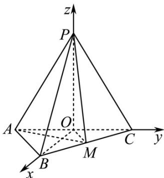
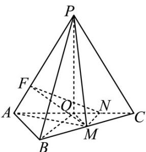
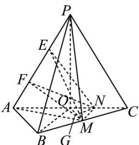
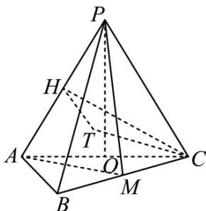

> [!faq]- 《专题21 立体几何大题综合》真题解析
>
> > [!success]- **【答案】** 详见解析
>
> > [!note]- **【分析】**
> > 【分析】（1）根据等腰三角形性质得 $PO$ 垂直 $AC$ ，再通过计算，根据勾股定理得 $PO$ 垂直 $OB$ ，最后根据线面垂直判定定理得结论；
> >
> > (2) 方法一：根据条件建立空间直角坐标系，设各点坐标，根据方程组解出平面 $PAM$ 一个法向量，利用向量数量积求出两个法向量夹角，根据二面角与法向量夹角相等或互补关系列方程，解得 $M$ 坐标，再利用向量数量积求得向量 $PC$ 与平面 $PAM$ 法向量夹角，最后根据线面角与向量夹角互余得结果。
>
> > [!note]- **【解析】**
> > 【详解】（1）因为 $AP = CP = AC = 4$ ， $O$ 为 $AC$ 的中点，所以 $OP \perp AC$ ，且 $OP = 2\sqrt{3}$ 连结 $OB$ ：
> > 因为 $AB = BC = \frac{\sqrt{2}}{2} AC$ ，所以 $\triangle ABC$ 为等腰直角三角形，
> > 且 $OB \perp AC, OB = \frac{1}{2} AC = 2$ ，由 $OP^2 + OB^2 = PB^2$ 知 $PO \perp OB$ 。
> > 由 $OP \perp OB, OP \perp AC$ 知， $PO \perp$ 平面 $ABC$
> > (2) [方法一]：【通性通法】向量法
> > 如图，以 $O$ 为坐标原点， $OB$ 的方向为 $x$ 轴正方向，建立空间直角坐标系 $O - xyz$
> > 
> > 由已知得 $O(0,0,0),B(2,0,0),A(0, - 2,0),C(0,2,0),P(0,0,2\sqrt{3}),AP = (0,2,2\sqrt{3})$
> > 取平面 PAC 的法向量 $OB = (2,0,0)$
> > 设 $M(a,2 - a,0)(0 < a\leq 2)$ ，则 $AM = (a,4 - a,0)$
> > 设平面PAM的法向量为 $n = (x,y,z)$
> > 由 $\overline{AP} \cdot n = 0, \overline{AM} \cdot n = 0$ 得 $\left\{\begin{aligned}&2y+2\sqrt{3}z=0\\ &ax+(4-a)y=0\end{aligned}\right.$
> > 可取 $2n = (\sqrt{3} (a - 4), \sqrt{3} a, -a)$
> > 所以 $\cos\langle\overrightarrow{OB}\cdot\overrightarrow{n}\rangle=\frac{2\sqrt{3}(a-4)}{2\sqrt{3(a-4)^{2}+3a^{2}+a^{2}}}$ 。由已知得 $\cos\langle\overrightarrow{OB}\cdot\overrightarrow{n}\rangle=\frac{\sqrt{3}}{2}$
> > 所以 $\frac{2\sqrt{3}|a - 4|}{2\sqrt{3(a - 4)^2 + 3a^2 + a^2}} = \frac{\sqrt{3}}{2}$ .解得 $_{a = -4}$ （舍去）， $a = \frac{4}{3}$
> > 所以 $\vec{n} = \left(-\frac{8\sqrt{3}}{3},\frac{4\sqrt{3}}{3}, - \frac{4}{3}\right)$
> > 又 $PC = (0,2, - 2\sqrt{3})$ ，所以 $\cos \langle PC,n\rangle = \frac{\sqrt{3}}{4}$
> > 所以 $PC$ 与平面 $PAM$ 所成角的正弦值为 $\frac{\sqrt{3}}{4}$
> > ## [方法二]：三垂线+等积法
> > 由（1）知 $PO \perp$ 平面 $ABC$ ，可得平面 $PAC \perp$ 平面 $ABC$ 。如图5，在平面 $ABC$ 内作 $MN \perp AC$ ，垂足为 $N$ ，则 $MN \perp$ 平面 $PAC$ 。在平面 $PAC$ 内作 $NF \perp AP$ ，垂足为 $F$ ，联结 $MF$ ，则 $MF \perp AP$ ，故 $\angle MFN$ 为二面角 $M - PA - C$ 的平面角，即 $\angle MFN = 30^{\circ}$ 。
> > 
> > 图5
> > 设 $MN = a$ ，则 $NC = a, AN = 4 - a$ ，在 $\mathrm{Rt}^{\triangle}AFN$ 中， $FN = \frac{\sqrt{3}}{2}(4 - a)$ 。在 $\mathrm{Rt}^{\triangle}MFN$ 中，由 $a = \frac{\sqrt{3}}{3} \cdot \frac{\sqrt{3}}{2} \cdot (4 - a)$ ，得 $a = \frac{4}{3}$ ，则 $FM = 2a = \frac{8}{3}$ 。设点 $C$ 到平面 $PAM$ 的距离为 $h$ ，由 $V_{M-APC} = V_{C-APM}$ ，得 $\frac{1}{3} \cdot \frac{\sqrt{3}}{4} \cdot 4^2 \cdot \frac{4}{3} = \frac{1}{3} \cdot \frac{1}{2} \cdot 4 \cdot \frac{8}{3} \cdot h$ ，解得 $h = \sqrt{3}$ ，则 $PC$ 与平面 $PAM$ 所成角的正弦值为 $\frac{\sqrt{3}}{4}$ 。
> > ## [方法三]：三垂线+线面角定义法
> > 由（1）知 $PO \perp$ 平面 $ABC$ ，可得平面 $PAC \perp$ 平面 $ABC$ 。如图6，在平面 $ABC$ 内作 $MN \perp AC$ ，垂足为 $N$ ，则 $MN \perp$ 平面 $PAC$ 。在平面 $PAC$ 内作 $NF \perp AP$ ，垂足为 $F$ ，联结 $MF$ ，则 $MF \perp AP$ ，故 $\angle MFN$ 为二面角 $M - PA - C$ 的平面角，即 $\angle MFN = 30^\circ$ 。同解法1可得 $MN = a = \frac{4}{3}$ 。
> > 
> > 图6
> > 在 $\triangle APC$ 中，过 $N$ 作 $NE\parallel PC$ ，在 $\triangle FNM$ 中，过 $N$ 作 $NG\perp FM$ ，垂足为 $G$ ，联结 $EG$ 。在 $Rt^{\triangle}NGM$ 中， $NG = \frac{\sqrt{3}}{2} NM = \frac{\sqrt{3}}{2}\cdot \frac{4}{3} = \frac{2\sqrt{3}}{3}$ 。因为 $NE\parallel PC$ ，所以 $NE = NA = 4 - a = \frac{8}{3}$ 。
> > 由 $PA \perp$ 平面 $FMN$ ，可得平面 $PAM \perp$ 平面 $FMN$ ，交线为 $FM$ ．在平面 $FMN$ 内，由 $NG \perp FM$ ，可得 $NG \perp$ 平面 $PAM$ ，则 $\angle NEG$ 为直线 $NE$ 与平面 $PAM$ 所成的角．
> > 设，则 $\sin \alpha = \frac{NG}{NE} = \frac{\frac{2}{3}\sqrt{3}}{\frac{8}{3}} = \frac{\sqrt{3}}{4}$ 又 $NE\parallel PC$ 与平面所成角的正弦值为 $\frac{\sqrt{3}}{4}$
> > ## [方法四]：【最优解】定义法
> > 如图7，取 $PA$ 的中点 $H$ ，联结 $CH$ ，则 $CH = 2\sqrt{3}$ 。过 $C$ 作平面 $PAM$ 的垂线，垂足记为 $T$ （垂足 $T$ 在平面 $PAM$ 内）。联结 $HT$ ，则 $\angle CHT$ 即为二面角 $M - PA - C$ 的平面角，即 $\angle CHT = 30^{\circ}$ ，得 $CT = \sqrt{3}$
> > 
> > 图7
> > 联结 $PT$ ，则 $\angle CPT$ 为直线 $PC$ 与平面 $PAM$ 所成的角．在 Rt△ $PCT$ 中， $PC = 4, CT = \sqrt{3}$ ，所以 $\sin \angle CPT = \frac{\sqrt{3}}{4}$ ．
> > 【整体点评】（2）方法一：根据题目条件建系，由二面角的向量公式以及线面角的向量公式硬算即可求出，是该类型题的通性通法；
> > 方法二：根据三垂线法找到二面角的平面角，再根据等积法求出点到面的距离，由定义求出线面角，是几
> > 何法解决空间角的基本手段；
> > 方法三：根据三垂线法找到二面角的平面角，再利用线面角的等价转化，然后利用定义法找到线面角解出，是几何法解决线面角的基本思想，对于该题，略显麻烦；
> > 方法四：直接根据二面角的定义和线面角的定义解决，原理简单，计算简单，是该题的最优解。
