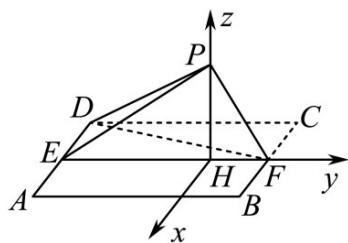
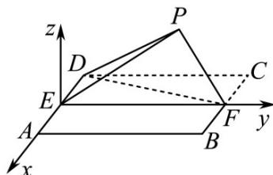
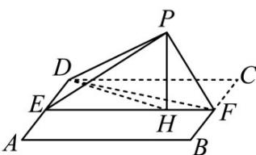

> [!faq]- 《专题21 立体几何大题综合》真题解析
>
> > [!success]- **【答案】** 详见解析
>
> > [!note]- **【分析】**
> > （1）依题可知 $BF \perp PF$ ， $BF \perp EF$ ，利用线面垂直的判定定理可得 $BF \perp$ 平面 $PEF$ ，再利用面面垂直的判定定理即可证出平面 $PEF \perp$ 平面 $ABFD$ ；
> >
> > （2）方法一：依题意建立相应的空间直角坐标系，求得平面 $ABFD$ 的法向量，设 $DP$ 与平面 $ABFD$ 所成角为 $\theta$ ，利用线面角的向量公式即可求出．
>
> > [!note]- **【解析】**
> > （1）由已知可得， $BF \perp PF$ ， $BF \perp EF$ ，又 $PF \cap EF = F$ ，所以 $BF \perp$ 平面 PEF·
> > 又 $BF \subset$ 平面 ABFD ，所以平面 $PEF \perp$ 平面 ABFD ；
> > (2)[方法一]：向量法
> > 作 $PH \perp EF$ ，垂足为 $H \cdot$ 由（1）得， $PH \perp$ 平面ABFD.
> > 以 $H$ 为坐标原点， $\stackrel{\square}{HF}$ 的方向为 $y$ 轴正方向，设 $\left|\stackrel{\square}{BF}\right| = 1$ ，建立如图所示的空间直角坐标系 $H - xyz\cdot$ 由（1）可得， $DE \perp PE \cdot$ 又 DP = 2 ，DE = 1 ，所以 $PE = \sqrt{3} \cdot$ 又 PF = 1 ，EF = 2 ，故 $PE \perp PF$ ，可得 $PH=\frac{\sqrt{3}}{2},EH=\frac{3}{2}.$
> > 
> > 则 $H(0,0,0), P\left(0,0, \frac{\sqrt{3}}{2}\right), D\left(-1, -\frac{3}{2}, 0\right), DP = \left(1, \frac{3}{2}, \frac{\sqrt{3}}{2}\right), HP = \left(0, 0, \frac{\sqrt{3}}{2}\right)$ 为平面 $ABFD$ 的法向量.
> > 设 与平面 所成角为，则 $\sin \theta = \left| \begin{array}{cc} \mathrm{u}_{\mathrm{u}} & \mathrm{u}_{\mathrm{u}} \\ HP & DP \\ \hline \mathrm{u}_{\mathrm{u}} & \mathrm{u}_{\mathrm{u}} \\ |HP| & |DP| \end{array} \right| = \frac{\frac{3}{4}}{\sqrt{3}} = \frac{\sqrt{3}}{4}$ .
> > 所以 DP 与平面 ABFD 所成角的正弦值为 $\frac{\sqrt{3}}{4}$ .
> > [方法2]：向量法
> > 如图 $^{3}$ 所示以 E 为原点建系．设正方形边长为 $^{2}$ ，由（1）知， $BF \perp$ 平面 PEF，则 $DE \perp$ 平面 PEF，故 $DE \perp PE$ ．易求 $PE = \sqrt{3}$ ，则点 P 到直线 EF 的距离为 $\frac{\sqrt{3}}{2}$ ，从而 $P\left(0, \frac{3}{2}, \frac{\sqrt{3}}{2}\right)$ .
> > 
> > 图3
> > 又 $D(-1,0,0)$ ，故 $\overrightarrow{DP} = \left(1,\frac{3}{2},\frac{\sqrt{3}}{2}\right)$ ，而平面ABFD的一个法向量 $n = (0,0,1)$ ，故与平面ABFD所成角的正弦值 $\sin \theta = |\cos \langle DP,n\rangle | = \left|\frac{\overrightarrow{DP}\cdot u}{|DP||n|}\right| = \frac{\frac{\sqrt{3}}{2}}{2} = \frac{\sqrt{3}}{4}$
> > [方法 3]：【最优解】定义法
> > 如图 $^{4}$ ，作 $PH \perp EF$ ，垂足为 H，联结 DH。
> > 
> > 图4
> > 由（1）知， $PH \perp$ 平面 ABFD，因此 $\angle PDH$ 为 DP 与平面 ABFD 所成的角。
> > 设正方形 ABCD 的边长为 $^{2}$ ，则 DE = 1，在 Rt△ PED 中， $PE = \sqrt{3}$
> > 又因为 PF = 1, EF = 2，由 $PE^{2} + PF^{2} = EF^{2}$ 知， $\angle EPF = 90^{\circ}, PH = \frac{\sqrt{3}}{2}$ ．又因为 PD = 2，所以在 Rt△ PHD 中， $\sin\angle PDH = \frac{PH}{PD} = \frac{\sqrt{3}}{4}$ ．
> > 所以 $DP$ 与平面 $ABFD$ 所成角的正弦值为 $\frac{\sqrt{3}}{4}$
> > [方法 4]：等积法
> > 不妨设 AB=2 ，则 $DE=1, PE=\sqrt{3}, DP=EF=2$ 。PE⊥PF ，又 PF⊥PD, PD∩PE=P ，所以 PF⊥平面 PDE 。设点 P 到平面 DEF 的距离为 d ，根据 $V_{F-PDE}=V_{P-DEF}$ ，即 $\frac{1}{3}\times\left(\frac{1}{2}\times1\times\sqrt{3}\right)\times1=\frac{1}{3}\times\left(\frac{1}{2}\times2\times1\right)\cdot d$ ，解得 $d=\frac{\sqrt{3}}{2}$ 。于是 PD 与平面 ABFD 所成角的正弦值为 $\frac{d}{DP}=\frac{\sqrt{3}}{4}$ 。
> > 【整体点评】（2）方法一：建立空间直角坐标系利用线面角的向量公式求解，可算作通性通法；
> > 方法二：同方法一，只是建系方式不一样；
> > 方法三：利用线面角的定义求解，计算量小，是该题的最优解；
> > 方法四：利用等积法求出点 $P$ 到平面 $DEF$ 的距离，再根据线面角的正弦公式即可求出，是线面角的常见求法。
