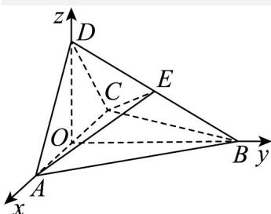

> [!faq]- 《专题21 立体几何大题综合》真题解析
>
> > [!success]- **【答案】** (1) 证明：平面 $ACD \perp$ 平面 ABC； (2) 过 $AC$ 的平面交 $BD$ 于点 $E$ , 若平面 $AEC$ 把四面体 $ABCD$ 分成体积相等的两部分, 求二面角 $D-AE-C$ 的余弦值. 【答案】 $(1)$ 见解析； $(2)$ $\frac{\sqrt{7}}{7}$
>
> > [!note]- **【分析】**
> > 本题未单列分析。
>
> > [!note]- **【解析】**
> > 试题分析：（1）利用题意证得二面角的平面角为 $90^{\circ}$ ，则可得到面面垂直；
> > (2) 利用题意求得两个半平面的法向量，然后利用二面角的夹角公式可求得二面角 $D-AE - C$ 的余弦值为 $\frac{\sqrt{7}}{7}$ .
> > 试题解析：（1）由题设可得， $\triangle ABD \cong \triangle CBD$ ，从而 $AD = DC$ 。
> > 又 $\triangle ACD$ 是直角三角形，所以 $\angle ADC = 90^{\circ}$ .
> > 取 $AC$ 的中点 $O$ ，连接 $DO, BO$ , 则 $DO \perp AC, DO = AO$ .
> > 又由于 $\triangle ABC$ 是正三角形，故 $BO \perp AC$ .
> > 所以 $\angle DOB$ 为二面角 $D - AC - B$ 的平面角.
> > 在 $Rt\triangle AOB$ 中， $BO^2 + AO^2 = AB^2$ .
> > 又 $AB = BD$ ，所以 $BO^2 + DO^2 = BO^2 + AO^2 = AB^2 = BD^2$ ，
> > 故 $\angle DOB = 90^\circ$ .
> > 所以平面 $ACD \perp$ 平面 $ABC$ .
> > (2) 由题设及 (1) 知，OA, OB, OD 两两垂直，以 O 为坐标原点，OA 的方向为 x 轴正方向 $\left|OA\right|$ 为单位长，建立如图所示的空间直角坐标系 O-xyz·则 $A(1,0,0), B(0,\sqrt{3},0), C(-1,0,0), D(0,0,1)$ .
> > 
> > 由题设知，四面体 $^{ABCE}$ 的体积为四面体 $^{ABCD}$ 的体积的 $\frac{1}{2}$ ，从而 $^{E}$ 到平面 $^{ABC}$ 的距离为 $^{D}$ 到平面 $^{ABC}$ 的距离的 $\frac{1}{2}$ ，即 $^{E}$ 为 $^{DB}$ 的中点，得 $E\left(0, \frac{\sqrt{3}}{2}, \frac{1}{2}\right)$ .
> > 故 $\stackrel{\square\square\square}{AD} = (-1, 0, 1), \stackrel{\square\square\square}{AC} = (-2, 0, 0), \stackrel{\square\square\square}{AE} = (-1, \frac{\sqrt{3}}{2}, \frac{1}{2})$ .
> > 设 $n = (x, y, z)$ 是平面 $^{DAE}$ 的法向量，则 $\begin{cases} n \cdot \stackrel{\square\square\square}{AD} = 0 \\ n \cdot AE = 0 \end{cases}$ 即 $\begin{cases} -x + z = 0, \\ -x + \frac{\sqrt{3}}{2}y + \frac{1}{2}z = 0. \end{cases}$ 可取 $n = \left(1, \frac{\sqrt{3}}{3}, 1\right)$ .
> > 设 $_{m}$ 是平面 $^{AEC}$ 的法向量，则 $\left\{\begin{aligned}&m\cdot\overline{AC}=0\\ &m\cdot AE=0\end{aligned}\right.$ 同理可取 $m=\left(0,-1,\sqrt{3}\right)\cdot$
> > 则 $\cos\left\langle n,m\right\rangle=\frac{n\cdot m}{|n||m|}=\frac{\sqrt{7}}{7}$ .
> > 所以二面角 $D - AE - C$ 的余弦值为 $\frac{\sqrt{7}}{7}$ .
> > 【名师点睛】（ $^{1}$ ）求解本题要注意两点：一是两平面的法向量的夹角不一定是所求的二面角，二是利用方程思想进行向量运算时，要认真细心，准确计算·
> > (2) 设 m, n 分别为平面 $\alpha$ , $\beta$ 的法向量，则二面角 $\theta$ 与 $\langle m, n \rangle$ 互补或相等，故有 $\left|\cos\theta\right|=\left|\cos m,n\right|=\frac{m\cdot n}{\left|m\right|\left|n\right|}$ ·求解时一定要注意结合实际图形判断所求角是锐角还是钝角.
