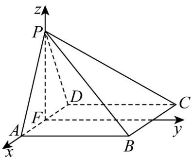

> [!faq]- 《专题21 立体几何大题综合》真题解析
>
> > [!success]- **【答案】** (1) 证明：平面 $PAB \perp$ 平面 PAD； (2) 若 $PA = PD = AB = DC$ ， $\angle APD = 90^{\circ}$ ，求二面角 $A - PB - C$ 的余弦值. 【答案】 $(1)$ 见解析； $(2) - \frac{\sqrt{3}}{3}$ .
>
> > [!note]- **【分析】**
> > 本题未单列分析。
>
> > [!note]- **【解析】**
> > （1）由已知 $\angle BAP = \angle CDP = 90^{\circ}$ ，得 $AB\bot AP$ ， $CD\bot PD$ ：
> > 由于 $AB \parallel CD$ ，故 $AB \perp PD$ ，从而 $AB \perp$ 平面 PAD。
> > 又 $AB \subset$ 平面 $PAB$ , 所以平面 $PAB \perp$ 平面 $PAD$ .
> > (2) 在平面 PAD 内作 $PF \perp AD$ ，垂足为 F，
> > 由（1）可知， $AB \perp$ 平面 PAD ，故 $AB \perp PF$ ，可得 $PF \perp$ 平面 ABCD .
> > 以 F 为坐标原点， $\overset{\cup\cup}{FA}$ 的方向为 x 轴正方向， $\left|\overset{\cup\cup}{AB}\right|$ 为单位长，建立如图所示的空间直角坐标系 F-xyz·
> > 
> > 由（1）及已知可得 $A\left(\frac{\sqrt{2}}{2},0,0\right)$ ， $P\left(0,0,\frac{\sqrt{2}}{2}\right)$ ， $B\left(\frac{\sqrt{2}}{2},1,0\right)$ ， $C\left(-\frac{\sqrt{2}}{2},1,0\right)$
> > 所以 $\overrightarrow{PC}=\left(-\frac{\sqrt{2}}{2},1,-\frac{\sqrt{2}}{2}\right)$ ， $\overrightarrow{CB}=\left(\sqrt{2},0,0\right)$ ， $\overrightarrow{PA}=\left(\frac{\sqrt{2}}{2},0,-\frac{\sqrt{2}}{2}\right)$ ， $\overrightarrow{AB}=\left(0,1,0\right)$ .
> > 设 $\Gamma n = (x, y, z)$ 是平面 $PCB$ 的法向量，则
> > $\left\{ \begin{array}{l} n \cdot \overset{\text{□□□}}{PC} = 0, \\ n \cdot CB = 0, \end{array} \right.$ 即 $\left\{ \begin{array}{l} -\frac{\sqrt{2}}{2} x + y - \frac{\sqrt{2}}{2} z = 0, \\ \sqrt{2} x = 0, \end{array} \right.$
> > 可取 $n = (0, -1, -\sqrt{2})$
> > 设 $m = (x,y,z)$ 是平面PAB的法向量，则
> > $\left\{ \begin{array}{l} m \cdot \stackrel{\square\square}{P} A = 0, \\ m \cdot A B = 0, \end{array} \right.$ 即 $\left\{ \begin{array}{l} \frac{\sqrt{2}}{2} x - \frac{\sqrt{2}}{2} z = 0, \\ y = 0. \end{array} \right.$ 可取 $m = (1,0,1)$ .
> > 则 $\cos \left\langle n, m \right\rangle = \frac{n \cdot m}{|n||m|} = -\frac{\sqrt{3}}{3}$
> > 所以二面角 $A - PB - C$ 的余弦值为 $-\frac{\sqrt{3}}{3}$
> > 【名师点睛】高考对空间向量与立体几何的考查主要体现在以下几个方面：
> > - **①**：求异面直线所成的角，关键是转化为两直线的方向向量的夹角；
> > - **②**：求直线与平面所成的角，关键是转化为直线的方向向量和平面的法向量的夹角；
> > - **③**：求二面角，关键是转化为两平面的法向量的夹角·建立空间直角坐标系和表示出所需点的坐标是解题的关键·
