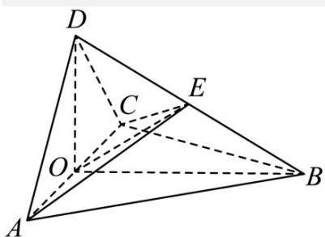

> [!faq]- 《专题21 立体几何大题综合》真题解析
>
> > [!success]- **【答案】** （1）见解析；（2）1:1. 【详解】试题分析：（1）取 $AC$ 的中点 $O$ ，由等腰三角形及等边三角形的性质得 $AC \perp OD$ ， $AC \perp OB$ ，再根据线面垂直的判定定理得 $AC \perp$ 平面 $OBD$ ，即得 $AC \perp BD$ ；（2）先由 $AE \perp EC$ ，结合平面几何知识确定 $EO = \frac{1}{2} AC$ ，再根据锥体的体积公式得所求体积之比为 1:1. 试题
>
> > [!note]- **【分析】**
> > 本题未单列分析。
>
> > [!note]- **【解析】**
> > 
> > (1) 取 $AC$ 的中点 $O$ , 连结 $DO$ , $BO$ .
> > 因为 AD=CD，所以 $AC \perp DO$ .
> > 又由于 $\triangle ABC$ 是正三角形，所以 $AC \perp BO$ .
> > 从而 $AC \perp$ 平面 DOB，故 $AC \perp BD$ .
> > (2) 连结 EO.
> > 由（1）及题设知 $\angle ADC = 90^{\circ}$ ，所以 $DO = AO$ 。
> > 在 $Rt\triangle AOB$ 中， $BO^{2} + AO^{2} = AB^{2}$ 。
> > 又 $AB = BD$ ，所以
> > $BO^{2}+DO^{2}=BO^{2}+AO^{2}=AB^{2}=BD^{2}$ ，故 $\angle DOB=90^{\circ}$
> > 由题设知 $\triangle AEC$ 为直角三角形，所以 $EO=\frac{1}{2}AC$ .
> > 又 $\triangle ABC$ 是正三角形，且 $AB = BD$ ，所以 $EO = \frac{1}{2} BD$
> > 故 $E$ 为 $BD$ 的中点，从而 $E$ 到平面 $ABC$ 的距离为 $D$ 到平面 $ABC$ 的距离的 $\frac{1}{2}$ ，四面体 $ABCE$ 的
> > 体积为四面体 $ABCD$ 的体积的 $\frac{1}{2}$ ，即四面体 $ABCE$ 与四面体 $ACDE$ 的体积之比为 $1:1$ .
> > 【名师点睛】垂直、平行关系证明中应用转化与化归思想的常见类型：
> > (1) 证明线面、面面平行，需转化为证明线线平行·
> > (2) 证明线面垂直，需转化为证明线线垂直·
> > (3) 证明线线垂直，需转化为证明线面垂直·
