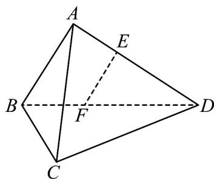

> [!faq]- 《专题21 立体几何大题综合》真题解析
>
> > [!success]- **【答案】** （1）见解析（2）见解析 【详解】试题分析：（1）先由平面几何知识证明 $EF \parallel AB$ ，再由线面平行判定定理得结论； (2) 先由面面垂直性质定理得 $BC \perp$ 平面 $ABD$ ，则 $BC \perp AD$ ，再由 $AB \perp AD$ 及线面垂直判定定理得 $AD \perp$ 平面 $ABC$ ，即可得 $AD \perp AC$ 。 试题
>
> > [!note]- **【分析】**
> > 本题未单列分析。
>
> > [!note]- **【解析】**
> > 证明：（1）在平面ABD内，因为 $AB \perp AD$ ， $EF \perp AD$ ，所以 $EF \parallel AB$ 。
> > 
> > 又因为 $EF \not\subset$ 平面 ABC， $AB \subset$ 平面 ABC，所以 $EF \parallel$ 平面 ABC.
> > (2) 因为平面 $ABD \perp$ 平面 BCD，
> > 平面 $ABD \cap$ 平面 BCD = BD，
> > $BC \subset$ 平面 $BCD$ , $BC \perp BD$
> > 所以 $BC \perp$ 平面 ABD.
> > 因为 $AD \subset$ 平面 ABD ，所以 $BC \perp$ $AD \cdot$
> > 又 $AB \perp AD$ ， $BC \cap AB = B$ ， $AB \subset$ 平面 ABC， $BC \subset$ 平面 ABC，
> > 所以 $AD \perp$ 平面 ABC ，
> > 又因为 $AC \subset$ 平面 ABC，所以 $AD \perp AC$ .
> > 点睛垂直、平行关系证明中应用转化与化归思想的常见类型：（1）证明线面、面面平行，需转化为证明线线平行；（2）证明线面垂直，需转化为证明线线垂直；（3）证明线线垂直，需转化为证明线面垂直。
