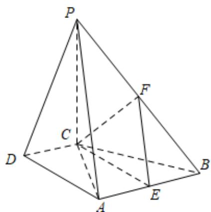

> [!faq]- 《专题21 立体几何大题综合》真题解析
>
> > [!success]- **【答案】** （Ⅰ）见解析；（Ⅱ）见解析；（Ⅲ）存在·理由见解析·
>
> > [!note]- **【分析】**
> > （Ⅰ）利用线面垂直判定定理证明；（Ⅱ）利用面面垂直判定定理证明；（Ⅲ）取 $^{PB}$ 中点 $^{F}$ ，连结
> >
> > EF，则 EF//PA，根据线面平行的判定定理证明 PA// 平面 CEF.
>
> > [!note]- **【解析】**
> > （1）因为 $PC \perp$ 平面 ABCD，
> > 所以PC⊥DC.
> > 又因为 $\mathrm{DC} \perp \mathrm{AC}$
> > 所以 $DC \perp$ 平面 $PAC$
> > (Ⅱ) 因为 AB//DC，DC ⊥ AC，
> > 所以 $\mathrm{AB} \perp \mathrm{AC}$
> > 因为 $PC \perp$ 平面ABCD
> > 所以PC⊥AB.
> > 所以 AB ⊥ 平面 PAC .
> > 所以平面 $PAB \perp$ 平面 $PAC$ .
> > (III) 棱 $^{PB}$ 上存在点 $^{F}$ ，使得PA//平面CEF．证明如下：
> > 取 $^{PB}$ 中点 $^{F}$ ，连结 $^{EF}$ ，CE，CF。
> > 又因为 E 为 AB 的中点，
> > 所以 EF//PA .
> > 又因为 $PA \notin$ 平面 $CEF$
> > 所以 PA// 平面 CEF
> > 
