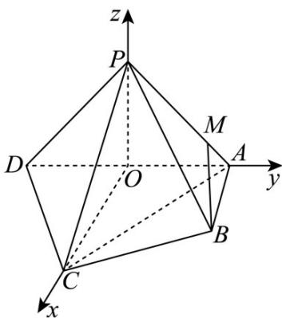
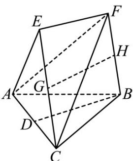
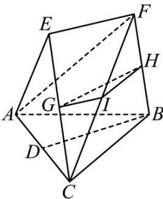

> [!faq]- 《专题21 立体几何大题综合》真题解析
>
> > [!success]- **【答案】** (1) 求证： $PD \perp$ 平面 PAB； (2) 求直线 PA 与平面 PCD 所成角的正弦值； (3) 在棱 $PA$ 上是否存在点 $M$ ，使得 $BM //$ 平面 $PCD$ ？若存在，求 $\frac{AM}{AP}$ 的值；若不存在，说明理由 【答案】（1）见解析；（2） $\frac{\sqrt{3}}{3}$ ；（3）存在， $\frac{AM}{AP}=\frac{1}{4}$
>
> > [!note]- **【分析】**
> > 本题未单列分析。
>
> > [!note]- **【解析】**
> > 试题分析：（1）由面面垂直性质定理知 $AB \perp$ 平面 $PAD$ ；根据线面垂直性质定理可知 $AB \perp PD$ ，再由线面垂直判定定理可知 $PD \perp$ 平面 $PAB$ ；（2）取 $AD$ 的中点 $O$ ，连结 $PO$ ， $CO$ ，以 $O$ 为坐标原点建立空间直角坐标系 $O - xyz$ ，利用向量法可求出直线 $PB$ 与平面 $PCD$ 所成角的正弦值；（3）假设存在，根据 $A$ ， $P$ ， $M$ 三点共线，设 $\overrightarrow{AM} = \lambda \overrightarrow{AP}$ ，根据 $BM //$ 平面 $PCD$ ，即 $\overrightarrow{BM} \cdot \overrightarrow{n} = 0$ ，求 $\lambda$ 的值，即可求出
> > $\frac{AM}{AP}$ 的值·
> > 试题解析：（1）因为平面 $PAD \perp$ 平面ABCD， $AB \perp AD$ ，
> > 所以 $AB \perp$ 平面 $PAD$ ，所以 $AB \perp PD$
> > 又因为 $PA \perp PD$ ，所以 $PD \perp$ 平面 PAB；
> > (2) 取 AD 的中点 O，连结 PO，CO，
> > 因为 $PA = PD$ ，所以 $PO \perp AD$ .
> > 又因为 $PO \subset$ 平面 $PAD$ ，平面 $PAD \perp$ 平面 $ABCD$ ，
> > 所以 $PO \perp$ 平面ABCD.
> > 因为 $CO \subset$ 平面ABCD，所以 $PO \perp CO$ .
> > 因为 AC = CD ，所以 $CO \perp AD$ .
> > 如图建立空间直角坐标系 $O - xyz$ ，由题意得，
> > $A(0,1,0), B(1,1,0), C(2,0,0), D(0,-1,0), P(0,0,1)$ .
> > 设平面 $PCD$ 的法向量为 $\vec{n} = (x, y, z)$ ，则
> > $\left\{ \begin{array}{l} \overrightarrow{n} \cdot \overrightarrow{PD} = 0, \\ \overrightarrow{n} \cdot \overrightarrow{PC} = 0, \end{array} \right.$ 即 $\left\{ \begin{array}{l} -y - z = 0, \\ 2x - z = 0, \end{array} \right.$
> > 令 $z = 2$ ，则 $x = 1, y = -2$ .
> > 所以 $\vec{n}=(1,-2,2)$ .
> > 又 $\overrightarrow{PB} = (1,1,-1)$ ，所以 $\cos <\vec{n},\overrightarrow{PB} > = \frac{\vec{n}\cdot\overrightarrow{PB}}{\left|\vec{n}\right|\left|\overrightarrow{PB}\right|} = -\frac{\sqrt{3}}{3}$ .
> > 所以直线 $_{PB}$ 与平面PCD所成角的正弦值为 $\frac{\sqrt{3}}{3}$
> > 
> > (3) 设 $M$ 是棱 $PA$ 上一点，则存在 $\lambda \in [0,1]$ 使得 $\overrightarrow{AM} = \lambda \overrightarrow{AP}$ .
> > 因此点 $M(0,1-\lambda,\lambda),\overrightarrow{BM}=(-1,-\lambda,\lambda)$ .
> > 因为 $BM \subset$ 平面 $PCD$ ，所以 $BM\|$ 平面 $PCD$ 当且仅当 $\overrightarrow{BM} \cdot \overrightarrow{n} = 0$
> > 即 $(-1, -\lambda, \lambda) \cdot (1, -2, 2) = 0$ ，解得 $\lambda = \frac{1}{4}$ .
> > 所以在棱 $PA$ 上存在点 $M$ 使得 $BM \parallel$ 平面 $PCD$ ，此时 $\frac{AM}{AP} = \frac{1}{4}$ .
> > 考点： $^{1}$ ·空间垂直判定与性质； $^{2}$ ·异面直线所成角的计算； $^{3}$ ·空间向量的运用·53．（2016·山东·高考真题）在如图所示的几何体中，D 是 AC 的中点，EF∥DB
> > 
> > (Ⅰ) 已知 AB=BC, AE=EC. 求证：AC⊥FB；
> > (II) 已知 $G, H$ 分别是 $EC$ 和 $FB$ 的中点·求证： $GH\parallel$ 平面 $ABC$
> > 【答案】（Ⅰ）证明：见解析；（Ⅱ）见解析·
> > 【详解】试题分析：（1）根据 $EF \parallel BD$ ，知 $EF$ 与 $BD$ 确定一个平面，连接 $DE$ ，得到 $DE \perp AC$
> > $BD \perp AC$ ，从而 $AC \perp$ 平面 $BDEF$ ，证得 $AC \perp FB \cdot (\text{II})$ 设 $FC$ 的中点为 $I$ ，连 $GI, HI$ ，在 $^{\triangle} CEF$
> > $\triangle CFB$ 中，由三角形中位线定理可得线线平行，证得平面 $GHI \parallel$ 平面 $ABC$ ，进一步得到 $GH \parallel$ 平面 $ABC$
> > 试题解析：（1）证明：因 $EF \parallel BD$ ，所以 $EF$ 与 $BD$ 确定平面 $BDEF$ ：
> > 
> > 连接 $DE$ ，因为 $AE = EC, D$ 为 $AC$ 的中点，所以 $DE \perp AC$ ，同理可得 $BD \perp AC$
> > 又 $BD \cap DE = D$ ，所以 $AC \perp$ 平面 $BDEF$
> > 因为 $FB \subset$ 平面 $BDEF$ ，所以 $AC \perp FB$ .
> > (II) 设 FC 的中点为 I，连 GI, HI.
> > 在 $\triangle CEF$ 中，因为 $G$ 是 $CE$ 的中点，所以 $GI \parallel EF$
> > 又 $EF \parallel DB$ ，所以 $GI \parallel DB$ .
> > 在 $\triangle CFB$ 中，因为 $H$ 是 $FB$ 的中点，所以 $HI \parallel BC$
> > 又 $GI \cap HI = I$ ，所以平面 $GHI \parallel$ 平面 $ABC$
> > 因为 $GH \subset$ 平面 GHI ，所以 $GH \parallel$ 平面 ABC .
> > 【考点】平行关系，垂直关系
> > 【名师点睛】本题主要考查直线与直线垂直、直线与平面平行·此类题目是立体几何中的基本问题·解答本题，关键在于能利用已知的直线与直线、直线与平面、平面与平面的位置关系，通过严密推理，给出规范的证明·本题能较好地考查考生的空间想象能力、逻辑推理能力及转化与化归思想等·
