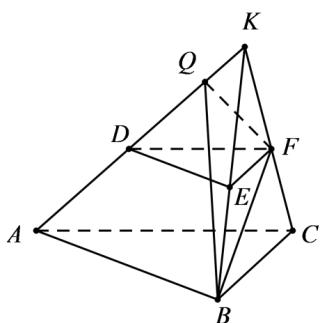
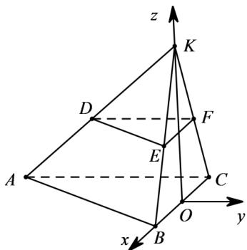

> [!faq]- 《专题21 立体几何大题综合》真题解析
>
> > [!success]- **【答案】** （Ⅰ）见解析；（Ⅱ） $\frac{\sqrt{3}}{4}$
>
> > [!note]- **【分析】**
> > （1）延长 $AD$ ，BE，CF相交于一点K，先证 $BF \perp AC$ ，再证 $BF \perp CK$ ，进而可证 $BF \perp$ 平面ACFD；
> >
> > （Ⅱ）方法一：先找二面角 $B - AD - F$ 的平面角，再在 $\mathrm{Rt}^{\triangle}BQF$ 中计算，即可得二面角 $B - AD - F$ 的平面角的余弦值；方法二：先建立空间直角坐标系，再计算平面ACK和平面ABK的法向量，进而可得二面角 $B - AD - F$ 的平面角的余弦值.
>
> > [!note]- **【解析】**
> > （Ⅰ）延长AD，BE，CF相交于一点K，如图所示.
> > 因为平面 $BCFE \perp$ 平面 ABC ，
> > 平面 $BCFE \cap$ 平面 ABC = BC ，且 $AC \perp BC$
> > 所以 $AC \perp$ 平面 BCK ， $BF \subset$ 平面 BCK ， 因此 $BF \perp AC$
> > 又因为 $EF / / BC$ ， $BE = EF = FC = 1$ ， $BC = 2$
> > 所以 $\triangle BCK$ 为等边三角形，且 $F$ 为 $CK$ 的中点，
> > 则 $BF \perp CK, CK \cap AC = C$
> > 所以 $BF \perp$ 平面 $ACFD$
> > 
> > (Ⅱ) 方法一：过点 F 作 $FQ \perp AK$ 于 Q，连结 BQ
> > 因为 $BF \perp$ 平面 $ACK$ ，所以 $BF \perp AK$ ， $BF \cap FQ = F$
> > 则 $AK \perp$ 平面 BQF ，所以 $BQ \perp AK$
> > 所以 $\angle BQF$ 是二面角 $B - AD - F$ 的平面角.
> > 在 $\mathrm{Rt}\triangle ACK$ 中， $AC = 3$ ， $CK = 2$ ，得 $FQ = \frac{3\sqrt{13}}{13}$
> > 在 $\mathrm{Rt}^{\triangle}$ $BQF$ 中， $FQ = \frac{3\sqrt{13}}{13}$ ， $BF = \sqrt{3}$ ，得 $\cos \angle BQF = \frac{\sqrt{3}}{4}$
> > 所以二面角 $B - AD - F$ 的平面角的余弦值为 $\frac{\sqrt{3}}{4}$
> > 方法二：如图，延长 $AD, BE, CF$ 相交于一点 $K$
> > 则 $\triangle BCK$ 为等边三角形．取 $BC$ 的中点 $O$ ，则 $KO \perp BC$
> > 又平面 $BCFE \perp$ 平面 $ABC$ ，所以， $KO \perp$ 平面 $ABC$
> > 以点 O 为原点，分别以射线 OB，OK 的方向为 x，z 的正方向，
> > 建立空间直角坐标系 Oxyz
> > 
> > 由题意得 $B(1,0,0)$ ， $C(-1,0,0)$ ， $K(0,0,\sqrt{3})$
> > $A(-1, - 3,0)$ ， $E(\frac{1}{2},0,\frac{\sqrt{3}}{2})$ ， $F(-\frac{1}{2},0,\frac{\sqrt{3}}{2})$
> > 因此， $AC=\left(0,3,0\right)$ ， $AK=\left(1,3,\sqrt{3}\right)$ ， $AB=\left(2,3,0\right)$
> > 设平面 ACK 的法向量为 $m = (x_{1}, y_{1}, z_{1})$
> > 平面 $ABK$ 的法向量为 $n = (x_{2},y_{2},z_{2})$
> > 由 $\left\{ \begin{array}{l} A C \cdot m = 0 \\ A K \cdot m = 0 \end{array} \right.$ ，得 $\left\{ \begin{array}{l} 3y_1 = 0 \\ x_1 + 3y_1 + \sqrt{3}z_1 = 0 \end{array} \right.$ ，
> > 取 $m = (\sqrt{3}, 0, -1)$ ;
> > 由 $\left\{ \begin{array}{l} AB \cdot n = 0 \\ AK \cdot n = 0 \end{array} \right.$ ，得 $\left\{ \begin{array}{l} 2x_2 + 3y_2 = 0 \\ x_2 + 3y_2 + \sqrt{3}z_2 = 0 \end{array} \right.$
> > 取 $n = (3, -2, \sqrt{3})$
> > 于是， $\cos \langle m, n \rangle = \frac{m \cdot n}{|m||n|} = \frac{3\sqrt{3} - \sqrt{3}}{\sqrt{3 + 1} \cdot \sqrt{9 + 4 + 3}} = \frac{\sqrt{3}}{4}$ 。
> > 所以，二面角 $B - AD - F$ 的平面角的余弦值为 $\frac{\sqrt{3}}{4}$
> > 【点睛】解题时一定要注意二面角的平面角是锐角还是钝角，否则很容易出现错误．证明线面垂直的关键是证明线线垂直，证明线线垂直常用的方法是直角三角形、等腰三角形的“三线合一”和菱形、正方形的对角线．
