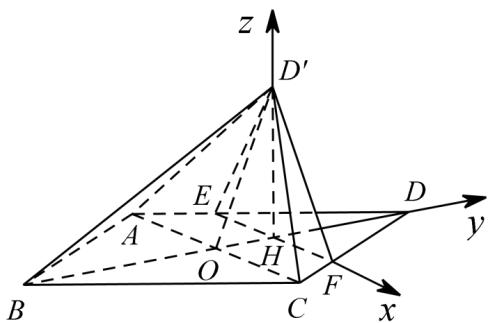

> [!faq]- 《专题21 立体几何大题综合》真题解析
>
> > [!success]- **【答案】** （1）证明见解析；（2） $\frac{2\sqrt{95}}{25}$ 【详解】试题分析：(1)证明线面垂直，一般利用线面垂直判定定理，即利用线线垂直进行论证，而线线垂直的寻找与论证往往需要利用平面几何条件，如本题需利用勾股定理经计算得出线垂直（2）一般可利用空间向量的数量积求二面角的大小，首先根据题意建立恰当的直角坐标系，设立各点坐标，利用方程组解出各面的法向量，再根据向量数量积求出两个法向量的夹角的余弦值，最后根据二面角与法向量夹角关系确定二面角的余弦值· 试题
>
> > [!note]- **【分析】**
> > 本题未单列分析。
>
> > [!note]- **【解析】**
> > (1)由已知得 $AC \perp BD$ ， $AD = CD$ ，又由 $AE = CF$ 得 $\frac{AE}{AD} = \frac{CF}{CD}$ ，故 $AC \parallel EF$ ，因此 $EF \perp HD$ ，从而 $EF \perp D'H$ ·由 $AB = 5$ ， $AC = 6$ 得 $DO = BO = \sqrt{AB^2 - AO^2} = 4$ .
> > 由 $AC\|_{EF}$ 得 $\frac{OH}{DO} = \frac{AE}{AD} = \frac{1}{4}$ 所以 $OH = 1,D'H = DH = 3$
> > 于是 $D^{\prime}H^{2} + OH^{2} = 3^{2} + 1^{2} = 10 = D^{\prime}O^{2}$ ，故 $D^{\prime}H\perp OH\cdot$ 又 $D^{\prime}H\perp EF$ ，而 $OH\cap EF = H$ ，所以 $D^{\prime}H\perp$ 平面ABCD.
> > 如图，以 $H$ 为坐标原点， $HF$ 的方向为 $x$ 轴的正方向，建立空间直角坐标系 $H - xyz$ ，则
> > 
> > $$
> > H (0, 0, 0), A (- 3, - 1, 0), B (0, - 6, 0), C (3, - 1, 0), D ^ {\prime} (0, 0, 3), \stackrel {{\square \square \square}} {{A B}} = (3, - 4, 0), \stackrel {{\square \square \square}} {{A C}} = (6, 0, 0)
> > $$
> > $$
> > A D ^ {\prime} = (3, 1, 3).
> > $$
> > 设 $m=\left(x_{1},y_{1},z_{1}\right)$ 是平面 $ABD'$ 的法向量，则 $\left\{\begin{aligned}&m\cdot AB=0\\&m\cdot AD'=0\end{aligned}\right.$ ，即 $\left\{\begin{aligned}&3x_{1}-4y_{1}=0\\&3x_{1}+y_{1}+3z_{1}=0\end{aligned}\right.$ ，可取 $m=\left(4,3,-5\right)$ .
> > 设 $n=\left(x_{2},y_{2},z_{2}\right)$ 是平面 $ACD'$ 的法向量，
> > 则 $\left\{ \begin{array}{l} n \cdot AC = 0 \\ \rightarrow \square \square \square \\ n \cdot AD' = 0 \end{array} \right.$ ，即 $\left\{ \begin{array}{l} 6x_2 = 0 \\ 3x_2 + y_2 + 3z_2 = 0 \end{array} \right.$ ，可取 $n = (0, -3, 1)$
> > 于是 $\cos\left\langle m,n\right\rangle=\frac{m\cdot n}{\left|m\right|\left|n\right|}=\frac{-14}{\sqrt{50}\times\sqrt{10}}=-\frac{7\sqrt{5}}{25}$
> > 设二面角的大小为 $\theta$ ， $\sin \theta = \frac{2\sqrt{95}}{25}$ ·因此二面角 $B - D'A - C$ 的正弦值是 $\frac{2\sqrt{95}}{25}$
> > 点睛：利用法向量求解空间线面角的关键在于“四破”：第一，破“建系关”，构建恰当的空间直角坐标系；第二，破“求坐标关”，准确求解相关点的坐标；第三，破“求法向量关”，求出平面的法向量；第四，破“应用公式关”。
