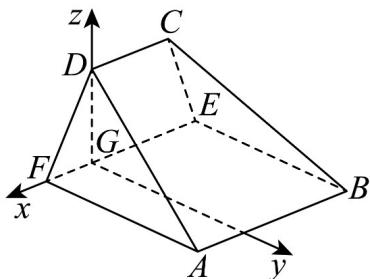

> [!faq]- 《专题21 立体几何大题综合》真题解析
>
> > [!success]- **【答案】** 详见解析
>
> > [!note]- **【分析】**
> > （Ⅰ）证明 $AF \perp$ 平面 EFDC，结合 $AF \subset$ 平面 ABEF，可得平面 $ABEF \perp$ 平面 EFDC。
> >
> > （Ⅱ）建立如图所示的空间坐标系，求出平面 EBC 的法向量和平面 BCA 的法向量的夹角的余弦值后可得所求的二面角的余弦值·
>
> > [!note]- **【解析】**
> > （Ⅰ）因为四边形ABEF为正方形，所以 $AF \perp FE$ ，
> > 又 $AF \perp DF$ ， $DF \cap FE = F$ ，所以 $AF \perp$ 平面 $EFDC$
> > 又 $AF \subset$ 平面 $ABEF$ ，故平面 $ABEF \perp$ 平面 $EFDC$ 。
> > (Ⅱ) 过 D 作 $DG \perp EF$ ，垂足为 G，
> > 因为平面 $ABEF \perp$ 平面 EFDC，平面 $ABEF \cap$ 平面 EFDC = EF
> > $DG \subset$ 平面 EFDC，故 $DG \perp$ 平面 ABEF。
> > 以 G 为坐标原点， $GF$ 的方向为 x 轴正方向， $GD$ 的方向为 z 轴正向，
> > 建立如图所示的空间直角坐标系 G - xyz
> > 由（1）知 $\angle DFE$ 为二面角 $D - AF - E$ 的平面角，故 $\angle DFE = 60^{\circ}$
> > 设 $\left|DF\right|=2a(a>0)$ ，则 $\left|DG\right|=\sqrt{3}a,\left|FG\right|=a$
> > 所以 $A(a,4a,0)$ ， $B(-3a,4a,0)$ ， $E(-3a,0,0)$ ， $D(0,0,\sqrt{3}a)$ 。
> > 由已知， $AB//EF$ ，而 $AB\not\subset$ 平面 EFDC， $EF\subset$ 平面 EFDC，
> > 所以 $AB \parallel$ 平面 $EFDC$ ，又平面 $ABCD \cap$ 平面 $EFDC = DC$ ， $AB \subset$ 平面 $ABCD$
> > 故 $AB \parallel CD$ ，所以 $CD \parallel EF$
> > 由 $BE // AF$ ，可得 $BE \perp$ 平面 $EFDC$ ，同理 $\angle CEF$ 为二面角 $C - BE - F$ 的平面角，
> > 所以 $\angle CEF = 60^{\circ}$ ，从而可得 $C\left(-2a,0,\sqrt{3} a\right)$
> > 所以 $\overset{\square\square}{EC}=\left(a,0,\sqrt{3}a\right)$ ， $\overset{\square\square}{EB}=\left(0,4a,0\right)$ ， $\overset{\square\square}{AC}=\left(-3a,-4a,\sqrt{3}a\right)$ ， $\overset{\square\square}{AB}=\left(-4a,0,0\right)$
> > 设 $n = (x, y, z)$ 是平面 $BCE$ 的法向量，
> > 则 $\left\{\begin{aligned}\boldsymbol{n}\cdot\boldsymbol{E}\boldsymbol{C}&=0\\ \boldsymbol{n}\cdot\boldsymbol{E}\boldsymbol{B}&=0\end{aligned}\right.$ ，即 $\left\{\begin{aligned}ax+\sqrt{3}az&=0\\ 4ay&=0\end{aligned}\right.$ ，取 x=3，则 $y=0,z=-\sqrt{3}$ ，
> > 可取 $n = (3,0, - \sqrt{3})$
> > 设 $\underset{m}{\cup}$ 是平面 $ABCD$ 的法向量，则 $\left\{ \begin{array}{l} m \cdot AC = 0 \\ m \cdot AB = 0 \end{array} \right.$ ，同理可取 $m = (0, \sqrt{3}, 4)$ ，
> > 则 $\cos \langle n, m \rangle = \frac{n \cdot m}{|n||m|} = -\frac{4\sqrt{3}}{2\sqrt{3} \times \sqrt{19}} = -\frac{2\sqrt{19}}{19}$
> > 因为二面角 $E - BC - A$ 的平面角为钝角，故二面角 $E - BC - A$ 的余弦值为 $-\frac{2\sqrt{19}}{19}$
> > 
> > 【点睛】立体几何解答题第一问通常考查线面位置关系的证明,空间中线面位置关系的证明主要包括线线、线面、面面三者的平行与垂直关系,其中推理论证的关键是结合空间想象能力进行推理,注意防止步骤不完整或考虑不全致推理片面,该类题目难度不大,以中档题为主·第二问一般考查角度问题,多用空间向量法解决
