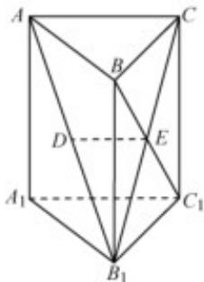

> [!faq]- 《专题21 立体几何大题综合》真题解析
>
> > [!success]- **【答案】** 详见解析
>
> > [!note]- **【分析】**
> > 本题未单列分析。
>
> > [!note]- **【解析】**
> > 【答案】$^{(1)}$ 详见解析 $^{(2)}$ 详见解析
> > 【详解】试题分析（1）由三棱锥性质知侧面 $BB_{1}C_{1}C$ 为平行四边形，因此点 $E$ 为 $B_{1}C$ 的中点，从而由三角形中位线性质得 $DE \parallel AC$ ，再由线面平行判定定理得 $DE \parallel$ 平面 $AA_{1}C_{1}C$ （2）因为直三棱柱 $ABC - A_{1}B_{1}C_{1}$ 中 $BC = CC_{1}$ ，所以侧面 $BB_{1}C_{1}C$ 为正方形，因此 $BC_{1} \perp B_{1}C$ ，又 $AC \perp BC$ ， $AC \perp CC_{1}$ （可由直三棱柱推导），因此由线面垂直判定定理得 $AC \perp$ 平面 $BB_{1}C_{1}C$ ，从而 $AC \perp BC_{1}$ ，再由线面垂直判定定理得
> > $BC_{1} \perp$ 平面 $AB_{1}C$ ，进而可得 $BC_{1} \perp AB_{1}$
> > 试题
> > 【答案】 $^{(1)}$ 详见解析 $^{(2)}$ 详见解析
> > 【详解】试题分析（1）由三棱锥性质知侧面 $BB_{1}C_{1}C$ 为平行四边形，因此点 $E$ 为 $B_{1}C$ 的中点，从而由三角形中位线性质得 $DE \parallel AC$ ，再由线面平行判定定理得 $DE \parallel$ 平面 $AA_{1}C_{1}C$ （2）因为直三棱柱 $ABC - A_{1}B_{1}C_{1}$ 中 $BC = CC_{1}$ ，所以侧面 $BB_{1}C_{1}C$ 为正方形，因此 $BC_{1} \perp B_{1}C$ ，又 $AC \perp BC$ ， $AC \perp CC_{1}$ （可由直三棱柱推导），因此由线面垂直判定定理得 $AC \perp$ 平面 $BB_{1}C_{1}C$ ，从而 $AC \perp BC_{1}$ ，再由线面垂直判定定理得
> > $BC_{1} \perp$ 平面 $AB_{1}C$ ，进而可得 $BC_{1} \perp AB_{1}$
> > 试题解析：（1）由题意知，E为 $\mathrm{B}_{1}\mathrm{C}$ 的中点，
> > 又D为 $\mathrm{AB}_{1}$ 的中点，因此DE//AC
> > 又因为 $\mathrm{DE} \notin$ 平面 $\mathrm{AA}_{1}\mathrm{C}_{1}\mathrm{C}$ ， $\mathrm{AC} \subset$ 平面 $\mathrm{AA}_{1}\mathrm{C}_{1}\mathrm{C}$
> > 所以 DE// 平面 $AA_{1}C_{1}C$
> > 
> > (2) 因为棱柱 $ABC-A_{1}B_{1}C_{1}$ 是直三棱柱，
> > 所以 $CC_{1} \perp$ 平面 ABC .
> > 因为 $\mathrm{AC} \subset$ 平面ABC，所以 $\mathrm{AC} \perp \mathrm{CC}_1$
> > 又因为 $\mathrm{AC} \perp \mathrm{BC}$ ， $\mathrm{CC}_1 \subset$ 平面 $\mathrm{BCC}_1\mathrm{B}_1$ ， $\mathrm{BC} \subset$ 平面 $\mathrm{BCC}_1\mathrm{B}_1$ ， $\mathrm{BC} \cap \mathrm{CC}_1 = \mathrm{C}$
> > 所以 $\mathrm{AC} \perp$ 平面 $\mathrm{BCC}_{1} \mathrm{~B}_{1}$
> > 又因为 $\mathrm{BC}_1\subset$ 平面 $\mathrm{BCC}_1\mathrm{B}_1$ ，所以 $\mathrm{BC}_1\perp \mathrm{AC}$
> > 因为 $\mathrm{BC} = \mathrm{CC}_1$ ，所以矩形 $\mathrm{BCC}_1\mathrm{B}_1$ 是正方形，因此 $\mathrm{BC}_1\perp \mathrm{B}_1\mathrm{C}$
> > 因为 AC， $B_{1}C \subset$ 平面 $B_{1}AC$ ， $AC \cap B_{1}C = C$ ，所以 $BC_{1} \perp$ 平面 $B_{1}AC$ 。
> > 又因为 $\mathrm{AB}_{1} \subset$ 平面 $\mathrm{B}_{1} \mathrm{AC}$ ，所以 $\mathrm{BC}_{1} \perp \mathrm{AB}_{1}$
> > 考点：线面平行判定定理，线面垂直判定定理
