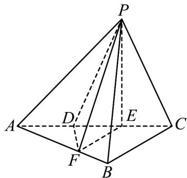

> [!faq]- 《专题21 立体几何大题综合》真题解析
>
> > [!success]- **【答案】** (1)见解析(2) BC=3 或 BC=3 $\sqrt{3}$
>
> > [!note]- **【分析】**
> > （Ⅰ）先由已知易得 $PE \perp AC$ ，再注意平面 $PAC \perp$ 平面ABC，且交线为AC，由面面垂直的性质可得 $PE \perp$ 平面ABC，再由线面垂直的性质可得到 $AB \perp PE$ ，再注意到 $EF // BC$ ，而 $BC \perp AB$ ，从而有 $AB \perp EF$ ，那么由线面垂的判定定理可得 $AB \perp$ 平面PFE，
> >
> > （Ⅱ）设 BC=x 则可用 x 将四棱锥 P-DFBC 的体积表示出来，由已知其体积等于 7，从而得到关于 x 的一个一元方程，解此方程，再注意到 x>0 即可得到 BC 的长．
>
> > [!note]- **【解析】**
> > 证明：如题（20）图·由 $DE = EC, PD = PC$ 知， $E$ 为等腰 $\Delta PDC$ 中 $DC$ 边的中点，故 $PE \perp AC$ ，
> > 
> > 又平面 $PAC \perp$ 平面 $ABC$ ，平面 $PAC \cap$ 平面 $ABC = AC$ ， $PE \subset$ 平面 $PAC$ ， $PE \perp AC$
> > 所以 $PE \perp$ 平面 ABC ，从而 $PE \perp AB \cdot$
> > 因 $\angle ABC=\frac{\pi}{2}, EF \parallel BC,$ 故 AB $\perp$ EF.
> > 从而 AB 与平面 PFE 内两条相交直线 PE，EF 都垂直，
> > 所以 AB ⊥ 平面 PFE ·
> > (2) 解：设 BC=x，则在直角 $\Delta ABC$ 中，
> > $AB=\sqrt{AC^{2}-BC^{2}}=\sqrt{36-x^{2}}$ ·从而 $S_{\Delta ABC}=\frac{1}{2}AB\times BC=\frac{1}{2}x\sqrt{36-x^{2}}$
> > 由 $EF\parallel BC$ ，知 $\frac{AF}{AB}=\frac{AE}{AC}=\frac{2}{3}$ ，得 $\Delta AEF\sim\Delta ABC$ ，故 $\frac{S_{\Delta AEF}}{S_{\Delta ABC}}=(\frac{2}{3})^{2}=\frac{4}{9}$ ，
> > 即 $S_{\Delta AEF} = \frac{4}{9} S_{\Delta ABC}$ .
> > 由 $\mathrm{AD} = \frac{1}{2} AE, \mathrm{S}_{\Delta AFB} = \frac{1}{2}\mathrm{S}_{\Delta AFE} = \frac{1}{2} \cdot \frac{4}{9}\mathrm{S}_{\Delta ABC} = \frac{2}{9}\mathrm{S}_{\Delta ABC} = \frac{1}{9} x\sqrt{36 - x^2}$
> > 从而四边形 DFBC 的面积为 $S_{DFBC} = S_{\Delta ABC} - S_{\Delta ADF} = \frac{1}{2} x \sqrt{36 - x^{2}} - \frac{1}{9} x \sqrt{36 - x^{2}} = \frac{7}{18} x \sqrt{36 - x^{2}}$
> > 由（1）知，PE PE⊥平面ABC，所以PE为四棱锥P-DFBC的高.
> > 在直角 $\Delta PEC$ 中， $PE=\sqrt{PC^{2}-EC^{2}}=\sqrt{4^{2}-2^{2}}=2\sqrt{3}$
> > 体积 $V_{P-DFBC}=\frac{1}{3}\cdot S_{DFBC}\cdot PE=\frac{1}{3}\cdot\frac{7}{18}x\sqrt{36-x^{2}}\cdot2\sqrt{3}=7$
> > 故得 $x^{4}-36x^{2}+243=0$ ，解得 $x^{2}=9$ 或 $x^{2}=27$ 由于 x>0，可得 x=3 或 $x=3\sqrt{3}$ .
> > 所以 BC = 3 或 $BC = 3\sqrt{3}$ .
> > 考点：1. 空间线面垂直关系，2. 锥体的体积，3. 方程思想
