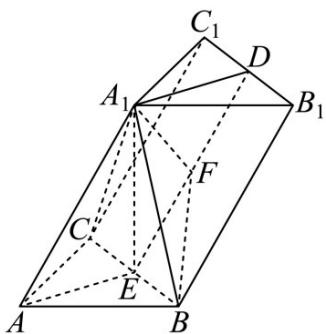

> [!faq]- 《专题21 立体几何大题综合》真题解析
>
> > [!success]- **【答案】** (1) 证明： $A_{1}D \perp$ 平面 $A_{1}BC$ ; (2) 求直线 $A_{1}B$ 和平面 $BB_{1}CC_{1}$ 所成的角的正弦值. 【答案】（1）见解析；（2） $\frac{\sqrt{7}}{8}$
>
> > [!note]- **【分析】**
> > 本题未单列分析。
>
> > [!note]- **【解析】**
> > （ $^{1}$ ）利用线面垂直的定义得到线线垂直，根据线面垂直的判定证明直线与平面垂直；
> > (2) 通过添加辅助线，证明 $A_{1}F \perp$ 平面 $BB_{1}C_{1}C$ ，以此找到直线与平面所成角的平面角 $\angle A_{1}BF$ ，在直角三角形 $A_{1}BF$ 中通过确定边长，计算 $\angle A_{1}BF$ 的正弦值.
> > 试题解析：（1）设E为BC中点，由题意得 $A_{1}E \perp$ 平面ABC，所以 $A_{1}E \perp AE$
> > 因为 AB = AC ，所以 $AE \perp BC$ .
> > 所以 $AE \perp$ 平面 $A_{1}BC$ .
> > 由 D，E 分别为 $B_{1}C_{1}, BC$ 的中点，得 $DE // BB_{1}$ 且 $DE = BB_{1}$ ，从而 $DE // AA_{1}$ 且 $DE = AA_{1}$ ，所以 $AA_{1}DE$ 是平行四边形，所以 $A_{1}D // AE$ 。
> > 因为 $AE \perp$ 平面 $A_{1}BC$ ，所以 $A_{1}D \perp$ 平面 $A_{1}BC$ 。
> > 
> > (2) 作 $A_{1}F \perp DE$ ，垂足为 $\mathrm{F}$ ，连结 $\mathrm{BF}$ .
> > 因为 $AE \perp$ 平面 $A_{1}BC$ ，所以 $BC \perp A_{1}E$ 。
> > 因为 $BC \perp AE$ ，所以 $BC \perp$ 平面 $AA_{1}DE$ 。
> > 所以 $BC \perp A_{1}F, A_{1}F \perp$ 平面 $BB_{1}C_{1}C$ .
> > 所以 $\angle A_{1}BF$ 为直线 $A_{1}B$ 与平面 $BB_{1}C_{1}C$ 所成角的平面角.
> > 由 $AB = AC = 2, \angle CAB = 90^{\circ}$ ，得 $EA = EB = \sqrt{2}$ 。
> > 由 $AE \perp$ 平面 $A_{1}BC$ ，得 $A_{1}A = A_{1}B = 4, A_{1}E = \sqrt{14}$ .
> > 由 $DE = BB_{1} = 4, DA_{1} = EA = \sqrt{2}, \angle DA_{1}E = 90^{\circ}$ ，得 $A_{1}F = \frac{\sqrt{7}}{2}$ .
> > 所以 $\sin\angle A_{1}BF=\frac{\sqrt{7}}{8}$
> > 考点：1. 空间直线、平面垂直关系的证明；2. 直线与平面所成的角。
