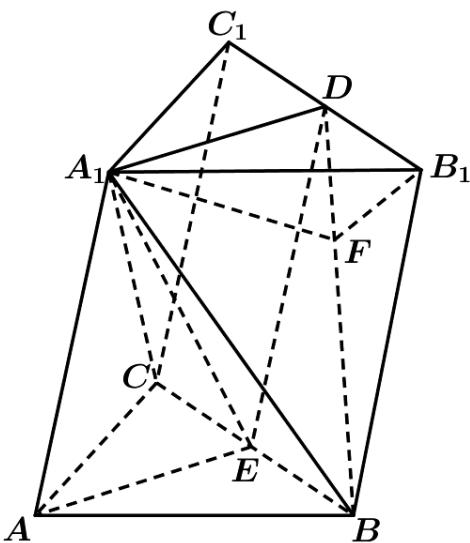

> [!faq]- 《专题21 立体几何大题综合》真题解析
>
> > [!success]- **【答案】** $(1)$ 详见解析； $(2)$ $-\frac{1}{8}$ 【详解】（1）根据条件首先证得 $AE \perp$ 平面 $A_{1}BC$ ，再证明 $A_{1}D // AE$ ，即可得证；（2）作 $A_{1}F \perp BD$ ，且 $A_{1}F \cap BD = F$ ，可证明 $\angle A_{1}FB_{1}$ 为二面角 $A_{1} - BD - B_{1}$ 的平面角，再由余弦定理即可求得 $\cos \angle A_{1}FB_{1} = -\frac{1}{8}$ ，从而求解· 试题
>
> > [!note]- **【分析】**
> > 本题未单列分析。
>
> > [!note]- **【解析】**
> > （1）设 $E$ 为 $BC$ 的中点，由题意得 $A_{1}E \perp$ 平面 $ABC$ ， $\therefore A_{1}E \perp AE$ ， $\because AB = AC$ ∴ $AE \perp BC$ ，故 $AE \perp$ 平面 $A_{1}BC$ ，由 $D$ ， $E$ 分别 $B_{1}C_{1}$ ， $BC$ 的中点，得 $DE // B_{1}B$ 且 $DE = B_{1}B$ ，从而 $DE // A_{1}A$ ，∴四边形 $A_{1}AED$ 为平行四边形，故 $A_{1}D // AE$ ，又∵ $AE \perp$ 平面 $A_{1}BC_{1}$ ，∴ $A_{1}D \perp$ 平面 $A_{1}BC_{1}$ ；（2）作 $A_{1}F \perp BD$ ，且 $A_{1}F \cap BD = F$ ，连结 $B_{1}F$ ，由 $AE = EB = \sqrt{2}$ ， $\angle A_{1}EA = \angle A_{1}EB = 90^{\circ}$ ，得 $A_{1}B = A_{1}A = 4$ ，由 $A_{1}D = B_{1}D$ ，
> > $A_{1}B = B_{1}B$ ，得 $\Delta A_{1}DB\cong \Delta B_{1}DB$ ，由 $A_{1}F\perp BD$ ，得 $B_{1}F\perp BD$ ，因此 $\angle A_1FB_1$ 为二面角 $A_{1} - BD - B_{1}$ 的平面角，由 $A_{1}D = \sqrt{2}$ ， $A_{1}B = 4$ ， $\angle DA_{1}B = 90^{\circ}$ ，得 $BD = 3\sqrt{2}$
> > $A_{1}F=B_{1}F=\frac{4}{3}$ ，由余弦定理得， $\cos\angle A_{1}FB_{1}=-\frac{1}{8}$
> > 
> > 考点： $^{1}$ ·线面垂直的判定与性质； $^{2}$ ·二面角的求解
