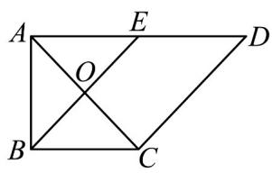
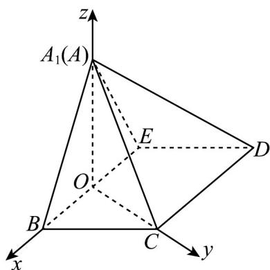

> [!faq]- 《专题21 立体几何大题综合》真题解析
>
> > [!success]- **【答案】** （Ⅰ）证明见解析；（Ⅱ） $\frac{\sqrt{6}}{3}$
>
> > [!note]- **【分析】**
> > 本题未单列分析。
>
> > [!note]- **【解析】**
> > 试题分析：（Ⅰ）先证 $BE \perp OA_{1}$ ， $BE \perp OC$ ，再可证 $BE \perp$ 平面 $A_{1}OC$ ，进而可证 $CD \perp$ 平面 $A_{1}OC$
> > （Ⅱ）先建立空间直角坐标系，再算出平面 $\mathrm{A}_{1} \mathrm{BC}$ 和平面 $\mathrm{A}_{1} \mathrm{CD}$ 的法向量，进而可得平面 $\mathrm{A}_{1} \mathrm{BC}$ 与平面 $\mathrm{A}_{1} \mathrm{CD}$ 夹角的余弦值。
> > 试题解析：（Ⅰ）在图 $^{1}$ 中，
> > 因为 AB = BC = 1，AD = 2，E 是 AD 的中点， $\angle BAD = \frac{\pi}{2}$ ，所以 BE ⊥ AC
> > 即在图 $^{2}$ 中，BE⊥OA $_{1}$ ，BE⊥OC
> > 从而BE⊥平面 $A_{1}OC$
> > 又 $\mathrm{CD} / / \mathrm{BE}$ ，所以 $\mathrm{CD} \perp$ 平面 $A_{1}OC$
> > 
> > 图1
> > 
> > 图2
> > (Ⅱ)由已知，平面 $A_{1}BE \perp$ 平面BCDE，又由（I）知， $\mathrm{BE} \perp OA_{1}$ ， $\mathrm{BE} \perp \mathrm{OC}$
> > 所以 $\angle A_{1}OC$ 为二面角 $A_{1}-BE-C$ 的平面角，所以 $\angle A_{1}OC=\frac{\pi}{2}$
> > 如图，以 O 为原点，建立空间直角坐标系，
> > 因为 $A_{1}B=A_{1}E=BC=ED=1$ ，BC//ED
> > 所以 $B(\frac{\sqrt{2}}{2},0,0),E(-\frac{\sqrt{2}}{2},0,0),A_{1}(0,0,\frac{\sqrt{2}}{2}),C(0,\frac{\sqrt{2}}{2},0),$
> > 得 $\overrightarrow{BC}(-\frac{\sqrt{2}}{2},\frac{\sqrt{2}}{2},0)$ ， $\overrightarrow{A_{1}C}(0,\frac{\sqrt{2}}{2},-\frac{\sqrt{2}}{2})$ ， $\overrightarrow{CD}=\overrightarrow{BE}=(-\sqrt{2},0,0)$
> > 设平面 $A_{1}\mathrm{BC}$ 的法向量 $\overline{n_1} = (x_1,y_1,z_1)$ ，平面 $A_{1}\mathrm{CD}$ 的法向量 $\overline{n_2} = (x_2,y_2,z_2)$ ，平面 $A_{1}\mathrm{BC}$ 与平面 $A_{1}\mathrm{CD}$ 夹角为 $\theta$ 。
> > 则 $\left\{ \begin{array}{l} p_{1} \cdot BC = 0 \\ n_{1} \cdot A_{1}C = 0 \end{array} \right.$ ，得 $\left\{ \begin{array}{l} -x_{1} + y_{1} = 0 \\ y_{1} - z_{1} = 0 \end{array} \right.$ ，取 $n_{1} = (1,1,1)$ ，
> > $\begin{aligned} & \stackrel{\sqcup}{n}_{\varphi}\cdot\stackrel{\sqcup\sqcup}{CD}=0\\ & \stackrel{\square}{n}_{2}\cdot A_{1}C=0\end{aligned}$ ，得 $\left\{\begin{aligned} & x_{2}=0\\ & y_{2}-z_{2}=0\end{aligned}\right.$ ，取 $\stackrel{\sqcup}{n}_{2}=(0,1,1)$ ，
> > 从而 $\cos\theta=\left|\cos\left\langle n_{1},n_{2}\right\rangle\right|=\frac{2}{\sqrt{3}\times\sqrt{2}}=\frac{\sqrt{6}}{3}$
> > 即平面 $A_{1}\mathrm{BC}$ 与平面 $A_{1}\mathrm{CD}$ 夹角的余弦值为 $\frac{\sqrt{6}}{3}$
> > 考点： $^{1}$ 、线面垂直； $^{2}$ 、二面角； $^{3}$ 、空间直角坐标系； $^{4}$ 、空间向量在立体几何中的应用。
