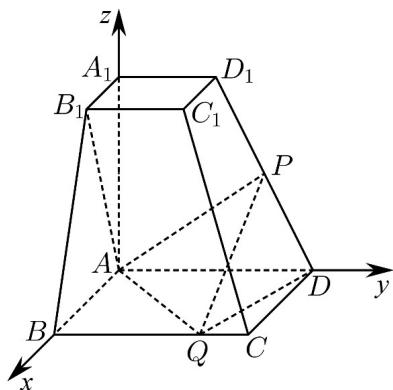

> [!faq]- 《专题21 立体几何大题综合》真题解析
>
> > [!success]- **【答案】** (1) 若 P 是 $DD_{1}$ 的中点，证明： $AB_{1} \perp PQ$ ； (2) 若 $PQ //$ 平面 $ABB_{1}A_{1}$ ，二面角 $P - QD - A$ 的余弦值为 $\frac{3}{7}$ ，求四面体 $ADPQ$ 的体积. 【答案】（1）见解析（2）V = 24
>
> > [!note]- **【分析】**
> > 本题未单列分析。
>
> > [!note]- **【解析】**
> > 根据已知条件知 $AB$ ， $AD$ ， $AA_{1}$ 三直线两两垂直，所以分别以这三直线为 $x$ ， $y$ ， $z$ 轴，建立如图所示空间直角坐标系，则：
> > $A(0,0,0)$ , $B(6,0,0)$ , $D(0,6,0)$ , $A_{1}(0,0,6)$ , $B_{1}(3,0,6)$ , $D_{1}(0,3,6)$ ;
> > Q 在棱 BC 上，设 $Q(6, y_{1}, 0)$ ， $0, y_{1}, 6$ ；
> > ∴（1）证明：若 $P$ 是 $DD_{1}$ 的中点，则 $P(0, \frac{9}{2}, 3)$
> > $$
> > \therefore \stackrel {\square \square \square} {P Q} = (6, y _ {1} - \frac {9}{2}, - 3), \quad A B _ {1} = (3, 0, 6)
> > $$
> > $$
> > \therefore A B _ {1} \cdot P Q = 0
> > $$
> > $$
> > \therefore A B _ {1} \perp P Q
> > $$
> > $$
> > \therefore A B _ {1} \perp P Q
> > $$
> > (2) 设 $P(0, y_{2}, z_{2})$ , $y_{2}$ , $z_{2} \in [0, 6]$ , P 在棱 $DD_{1}$ 上；
> > $$
> > \therefore \stackrel {{\sqcup \sqcup \sqcup}} {D P} = \lambda \stackrel {{\sqcup \sqcup \sqcup \sqcup}} {D D _ {1}}, 0,, \lambda ,, 1
> > $$
> > $$
> > \therefore (0, y _ {2} - 6, z _ {2}) = \lambda (0, - 3, 6)
> > $$
> > $$
> > \therefore \left\{ \begin{array}{l} y _ {2} - 6 = - 3 \lambda \\ z _ {2} = 6 \lambda \end{array} ; \right.
> > $$
> > $\therefore z_{2} = 12 - 2y_{2}$
> > $\therefore P(0, y_2, 12 - 2y_2)$
> > $$
> > \therefore P Q = (6, y _ {1} - y _ {2}, 2 y _ {2} - 1 2)
> > $$
> > 平面 $ABB_{1}A_{1}$ 的一个法向量为 $AD=(0,6,0)$ ；
> > ∵ $PQ//$ 平面 $ABB_{1}A_{1}$ ;
> > ∴ $PQ\cdot AD=6(y_{1}-y_{2})=0$ ;
> > ∴ $y_{1}=y_{2}$ ;
> > ∴ $Q(6,y_{2},0)$ ;
> > 设平面 $PQD$ 的法向量为 $n = (x, y, z)$ ，则：
> > $$
> > \left\{ \begin{array}{l} n \cdot P Q = 6 x + (2 y _ {2} - 1 2) z = 0 \\ n \cdot D Q = 6 x + (y _ {2} - 6) y = 0 \end{array} \right.
> > $$
> > $\therefore \left\{ \begin{array}{l} x = \frac{6 - y_2}{3} z \\ y = 2z \end{array} \right.$ 取 $z = 1$ ，则 $\vec{n} = (\frac{6 - y_2}{3}, 2, 1)$
> > 又平面 AQD 的一个法向量为 $AA_{1} = (0, 0, 6)$ ;
> > 又二面角 $P - QD - A$ 的余弦值为 $\frac{3}{7}$ ；
> > $$
> > \cos \left\langle \stackrel {\rightarrow} {n}, A A _ {1} \right\rangle = \frac {6}{6 \sqrt {\left(\frac {y _ {2} - 6}{3}\right) ^ {2} + 5}} = \frac {3}{7}
> > $$
> > 解得 $y_{2}=4$ ，或 $y_{2}=8$ （舍去）；
> > $\therefore P(0, 4, 4)$ ;
> > ∴ 三棱锥 P-ADQ 的高为 $^{4}$ ，且 $S_{ADQ}=\frac{1}{2}\times6\times6=18$ ；
> > $$
> > \therefore V _ {\mathrm{四面体} A D P Q} = V _ {\mathrm{三棱锥} P - A D Q} = \frac {1}{3} \cdot 1 8 \cdot 4 = 2 4
> > $$
> > 
> > 考点：1·空间向量的运用；2·线面垂直的性质；3·空间几何体体积计算
> > 【名师点睛】本题主要考查了线面垂直的性质以及空间几何体体积计算，属于中档题，由于空间向量工具的引入，使得立体几何问题除了常规的几何法之外，还可以考虑利用向量工具来解决，因此有关立体几何的问题，可以建立空间直角坐标系，借助于向量知识来解决，在立体几何的线面关系中，中点是经常使用的一个特殊点，无论是试题本身的已知条件，还是在具体的解题中，通过找“中点”，连“中点”，即可出现平行线而线线平行是平行关系的根本，在垂直关系的证明中线线垂直是核心，也可以根据已知的平面图形通过计算的方式证明线线垂直，也可以根据已知的垂直关系证明线线垂直。
