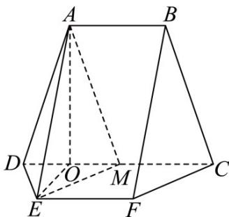

> [!faq]- 《专题21 立体几何大题综合》真题解析
>
> > [!success]- **【答案】** 详见解析
>
> > [!note]- **【分析】**
> > 【分析】（1）结合已知易证四边形 EFCM 为平行四边形，可证 EM//FC，进而得证；
> >
> > (2) 先证明 $OA \perp$ 平面 EDM，结合等体积法 $V_{M-ADE} = V_{A-EDM}$ 即可求解.
>
> > [!note]- **【解析】**
> > 【详解】（1）由题意得， $EF // MC$ ，且 EF = MC
> > 所以四边形 EFCM 是平行四边形，所以 EM // FC
> > 又 $CF \subset$ 平面 $BCF, EM \subset$ 平面 $BCF$
> > 所以 $EM / /$ 平面 $BCF$ ；
> > (2) 取 DM 的中点 O，连接 OA，OE，因为 AB // MC，且 AB = MC
> > 所以四边形 $AMCB$ 是平行四边形，所以 $AM = BC = \sqrt{10}$
> > 又 $AD = \sqrt{10}$ ，故△ADM是等腰三角形，同理△EDM是等腰三角形，
> > 可得 $OA \perp DM, OE \perp DM, OA = \sqrt{AD^2 - \left(\frac{DM}{2}\right)^2} = 3, OE = \sqrt{ED^2 - \left(\frac{DM}{2}\right)^2} = \sqrt{3}$
> > 又 $AE = 2\sqrt{3}$ ，所以 $OA^{2} + OE^{2} = AE^{2}$ ，故 $OA \perp OE$ 。
> > 又 $OA \perp DM, OE \cap DM = O, OE, DM \subset$ 平面 $EDM$ ，所以 $OA \perp$ 平面 $EDM$
> > 易知 $S_{\triangle EDM} = \frac{1}{2} \times 2 \times \sqrt{3} = \sqrt{3}$ .
> > 在 $V_{ADE}$ 中， $\cos\angle DEA=\frac{4+12-10}{2\times2\times2\sqrt{3}}=\frac{\sqrt{3}}{4}$ ，
> > 所以 $\sin\angle DEA=\frac{\sqrt{13}}{4},S_{\triangle DEA}=\frac{1}{2}\times2\times2\sqrt{3}\times\frac{\sqrt{13}}{4}=\frac{\sqrt{39}}{2}.$
> > 设点 M 到平面 ADE 的距离为 d，由 $V_{M-ADE} = V_{A-EDM}$ ，
> > 得 $\frac{1}{3} S_{\triangle ADE}\cdot d = \frac{1}{3} S_{\triangle EDM}\cdot OA$ ，得 $d = \frac{6\sqrt{13}}{13}$
> > 故点 M 到平面 ADE 的距离为 $\frac{6\sqrt{13}}{13}$ .
> > 
