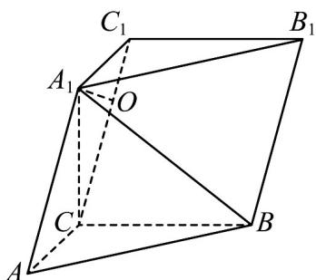

> [!faq]- 《专题21 立体几何大题综合》真题解析
>
> > [!success]- **【答案】** 详见解析
>
> > [!note]- **【分析】**
> > 【分析】(1)由 $A_{1}C \perp$ 平面 ABC 得 $A_{1}C \perp BC$ ，又因为 $AC \perp BC$ ，可证 $BC \perp$ 平面 $ACC_{1}A_{1}$ ，从而证得平面 $ACC_{1}A_{1} \perp$ 平面 $BCC_{1}B_{1}$ ；
> >
> > (2) 过点 $A_{1}$ 作 $A_{1}O \perp CC_{1}$ ，可证四棱锥的高为 $A_{1}O$ ，由三角形全等可证 $A_{1}C = AC$ ，从而证得 $O$ 为 $CC_{1}$ 中点，设
> >
> > $A_{1}C = AC = x$ ，由勾股定理可求出 x，再由勾股定理即可求 $A_{1}O$ .
>
> > [!note]- **【解析】**
> > 【详解】（1）证明：因为 $A_{1}C \perp$ 平面 ABC， $BC \subset$ 平面 ABC，
> > 所以 $A_{1}C \perp BC$ ,
> > 又因为 $\angle ACB = 90^{\circ}$ ，即 $AC \perp BC$
> > $A_{1}C, AC \subset$ 平面 $ACC_{1}A_{1}$ , $A_{1}C \cap AC = C$ ,
> > 所以 $BC \perp$ 平面 $ACC_{1}A_{1}$
> > $$
> > B C C _ {1} B _ {1}
> > $$
> > 所以平面 $ACC_{1}A_{1} \perp$ 平面 $BCC_{1}B_{1}$ .
> > (2) 如图，
> > 
> > 过点 $A_{1}$ 作 $A_{1}O \perp CC_{1}$ ，垂足为 O.
> > 因为平面 $ACC_{1}A_{1}\perp$ 平面 $BCC_{1}B_{1}$ ，平面 $ACC_{1}A_{1}\cap$ 平面 $BCC_{1}B_{1} = CC_{1}$ ， $A_{1}O\subset$ 平面 $ACC_{1}A_{1}$
> > 所以 $A_{1}O \perp$ 平面 $BCC_{1}B_{1}$
> > 所以四棱锥 $A_{1}-BB_{1}C_{1}C$ 的高为 $A_{1}O$ .
> > 因为 $A_{1}C \perp$ 平面 ABC ， $AC, BC \subset$ 平面 ABC，
> > 所以 $A_{1}C \perp BC, A_{1}C \perp AC,$
> > 又因为 $A_{1}B = AB$ ，BC 为公共边，
> > 所以 $\triangle ABC$ 与 $\triangle A_{1}BC$ 全等，所以 $A_{1}C = AC$ .
> > 设 $A_{1}C = AC = x$ ，则 $A_{1}C_{1} = x$
> > 所以 O 为 $CC_{1}$ 中点， $OC_{1}=\frac{1}{2}AA_{1}=1$ ，
> > 又因为 $A_{1}C \perp AC$ ，所以 $A_{1}C^{2} + AC^{2} = AA_{1}^{2}$
> > 即 $x^{2} + x^{2} = 2^{2}$ ，解得 $x = \sqrt{2}$
> > 所以 $A_{1}O=\sqrt{A_{1}C_{1}^{2}-OC_{1}^{2}}=\sqrt{\left(\sqrt{2}\right)^{2}-1^{2}}=1$
> > 所以四棱锥 $A_{1}-BB_{1}C_{1}C$ 的高为 1 .
