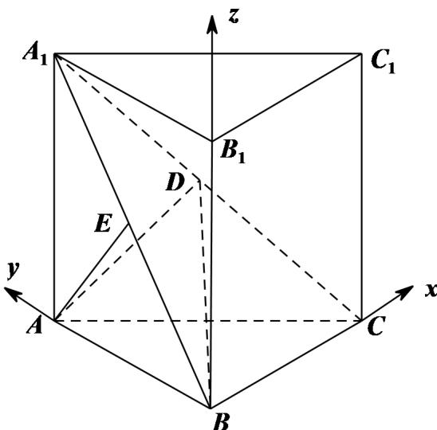

> [!faq]- 《专题21 立体几何大题综合》真题解析
>
> > [!success]- **【答案】** 详见解析
>
> > [!note]- **【分析】**
> > 【分析】（ $^{1}$ ）由等体积法运算即可得解；
> >
> > (2) 由面面垂直的性质及判定可得 $BC \perp$ 平面 $ABB_{1}A_{1}$ ，建立空间直角坐标系，利用空间向量法即可得解
>
> > [!note]- **【解析】**
> > 【详解】（1）在直三棱柱 $ABC - A_{1}B_{1}C_{1}$ 中，设点 A 到平面 $A_{1}BC$ 的距离为 h，
> > $$
> > V _ {A - A _ {1} B C} = \frac {1}{3} S _ {\triangle A _ {1} B C} \cdot h = \frac {2 \sqrt {2}}{3} h = V _ {A _ {1} - A B C} = \frac {1}{3} S _ {\triangle A B C} \cdot A _ {1} A = \frac {1}{3} V _ {A B C - A _ {1} B _ {1} C _ {1}} = \frac {4}{3}
> > $$
> > 解得 $h = \sqrt{2}$
> > 所以点 A 到平面 $A_{1}BC$ 的距离为 $\sqrt{2}$ ;
> > <!-- source-part:2 pages:201-400 -->
> > (2) 取 $A_{1}B$ 的中点 $E$ , 连接 $AE$ , 如图, 因为 $AA_{1} = AB$ , 所以 $AE \perp A_{1}B$ , 又平面 $A_{1}BC \perp$ 平面 $ABB_{1}A_{1}$ , 平面 $A_{1}BC \cap$ 平面 $ABB_{1}A_{1} = A_{1}B$ , 且 $AE \subset$ 平面 $ABB_{1}A_{1}$ , 所以 $AE \perp$ 平面 $A_{1}BC$ , 在直三棱柱 $ABC - A_{1}B_{1}C_{1}$ 中, $BB_{1} \perp$ 平面 $ABC$ , 由 $BC \subset$ 平面 $A_{1}BC$ , $BC \subset$ 平面 $ABC$ 可得 $AE \perp BC$ , $BB_{1} \perp BC$ , 又 $AE, BB_{1} \subset$ 平面 $ABB_{1}A_{1}$ 且相交, 所以 $BC \perp$ 平面 $ABB_{1}A_{1}$ , 所以 $BC, BA, BB_{1}$ 两两垂直, 以 $B$ 为原点, 建立空间直角坐标系, 如图
> > 
> > 由（1）得 $AE = \sqrt{2}$ ，所以 $AA_{1} = AB = 2$ ， $A_{1}B = 2\sqrt{2}$ ，所以 BC = 2，
> > 则 $A(0,2,0), A_{1}(0,2,2), B(0,0,0), C(2,0,0)$ ，所以 $A_{1}C$ 的中点 $D(1,1,1)$ ，
> > 则 $\overline{BD}=(1,1,1)$ ， $\overline{BA}=(0,2,0)$ ， $\overline{BC}=(2,0,0)$ ，
> > 设平面 $_{ABD}$ 的一个法向量 $m = (x, y, z)$ ，则 $\left\{\begin{aligned}\vec{m} \cdot \vec{BD} & = x + y + z = 0 \\ \vec{m} \cdot \vec{BA} & = 2y = 0\end{aligned}\right.$ ，
> > 可取 $m = (1, 0, -1)$ ，
> > 设平面 BDC 的一个法向量 $n = (a, b, c)$ ，则 $\left\{\begin{aligned}\vec{n} \cdot \vec{BD} & = a + b + c = 0 \\ \vec{n} \cdot BC & = 2a = 0\end{aligned}\right.$ ，
> > 可取 $n = (0, 1, -1)$ ，
> > 则 $\cos \left\langle \vec{m}, n \right\rangle = \frac{\vec{m} \cdot n}{|m| \cdot |n|} = \frac{1}{\sqrt{2} \times \sqrt{2}} = \frac{1}{2}$
> > 所以二面角 $A - BD - C$ 的正弦值为 $\sqrt{1 - \left(\frac{1}{2}\right)^2} = \frac{\sqrt{3}}{2}$
