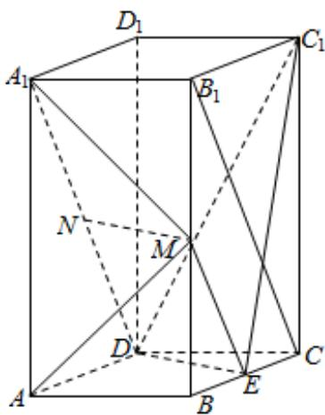

> [!faq]- 《专题21 立体几何大题综合》真题解析
>
> > [!success]- **【答案】** 详见解析
>
> > [!note]- **【分析】**
> > 【分析】（1）利用三角形中位线和 $A_{1}D / / B_{1}C$ 可证得 $ME / / ND$ ，证得四边形MNDE为平行四边形，进而证得 $MN / / DE$ ，根据线面平行判定定理可证得结论；
> >
> > (2) 根据题意求得三棱锥 $C_{1} - CDE$ 的体积，再求出 $\Delta C_{1}DE$ 的面积，利用 $V_{C_1 - CDE} = V_{C - C_1DE}$ 求得点 $C$ 到平面 $C_{1}DE$ 的距离，得到结果.
>
> > [!note]- **【解析】**
> > 【详解】（1）连接ME， $B_{1}C$
> > 
> > ，分别为 ，中点 为 的中位线
> > $\because M \quad E \quad BB_{1} \quad BC \quad \therefore ME \quad \Delta B_{1}BC$
> > $\therefore ME // B_{1}C$ 且 $ME = \frac{1}{2} B_{1}C$
> > 又 $N$ 为 $A_{1}D$ 中点，且 $A_{1}D \parallel B_{1}C \therefore ND \parallel B_{1}C$ 且 $ND = \frac{1}{2} B_{1}C$
> > $\therefore ME \underline{ // ND}$ $\therefore$ 四边形 $MNDE$ 为平行四边形
> > $\therefore MN // DE$ ，又 $MN \not\subset$ 平面 $C_1DE$ ， $DE \subset$ 平面 $C_1DE$
> > ∴MN//平面 $C_{1}DE$
> > (2) 在菱形 ABCD 中，E 为 BC 中点，所以 $DE \perp BC$
> > 根据题意有 $DE = \sqrt{3}$ ， $C_1E = \sqrt{17}$
> > 因为棱柱为直棱柱，所以有 $DE \perp$ 平面 $BCC_{1}B_{1}$
> > 所以 $DE \perp EC_{1}$ ，所以 $S_{\Delta DEC_1} = \frac{1}{2} \times \sqrt{3} \times \sqrt{17}$
> > 设点 $^{C}$ 到平面 $C_{1}DE$ 的距离为d，
> > 根据题意有 $V_{C_1 - CDE} = V_{C - C_1DE}$ ，则有 $\frac{1}{3}\times \frac{1}{2}\times \sqrt{3}\times \sqrt{17}\times d = \frac{1}{3}\times \frac{1}{2}\times 1\times \sqrt{3}\times 4$
> > 解得 $d = \frac{4}{\sqrt{17}} = \frac{4\sqrt{17}}{17}$
> > 所以点 $^{C}$ 到平面 $C_{1}DE$ 的距离为 $\frac{4\sqrt{17}}{17}$ .
> > 【点睛】该题考查的是有关立体几何的问题，涉及到的知识点有线面平行的判定，点到平面的距离的求解，在解题的过程中，注意要熟记线面平行的判定定理的内容，注意平行线的寻找思路，再者就是利用等积法求点到平面的距离是文科生常考的内容·
