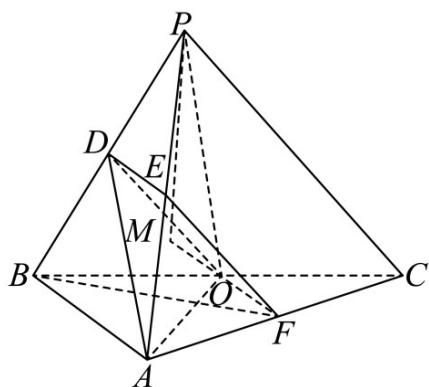

> [!faq]- 《专题21 立体几何大题综合》真题解析
>
> > [!success]- **【答案】** 详见解析
>
> > [!note]- **【分析】**
> > 【分析】（1）根据给定条件，证明四边形 ODEF 为平行四边形，再利用线面平行的判定推理作答.
> > (2) 作出并证明 PM 为棱锥的高，利用三棱锥的体积公式直接可求体积.
>
> > [!note]- **【解析】**
> > 【详解】（1）连接 $DE, OF$ ，设 $AF = tAC$ ，则 $\overline{BF} = \overline{BA} + \overline{AF} = (1 - t)\overline{BA} + tBC$ ， $\overline{AO} = -\overline{BA} + \frac{1}{2}\overline{BC}$ ， $BF \perp AO$ ，
> > 则 $BF\cdot AO = [(1 - t)BA + tBC]\cdot (-BA + \frac{1}{2} BC) = (t - 1)BA^2 +\frac{1}{2} tBC^2 = 4(t - 1) + 4t = 0$
> > 解得 $t = \frac{1}{2}$ ，则 $F$ 为 $AC$ 的中点，由 $D, E, O, F$ 分别为 $PB, PA, BC, AC$ 的中点，
> > 于是 $DE / / AB, DE = \frac{1}{2} AB, OF / / AB, OF = \frac{1}{2} AB$ ，即 $DE / / OF, DE = OF$ ，
> > 则四边形 ODEF 为平行四边形，
> > $EF //DO, EF = DO$ ，又 $EF \not\subset$ 平面 $ADO, DO \subset$ 平面 ADO，
> > 所以 EF // 平面 ADO.
> > (2) 过 $P$ 作 $PM$ 垂直 $FO$ 的延长线交于点 $M$
> > 因为 PB = PC, O 是 BC 中点，所以 $PO \perp BC$ ,
> > 在 Rt△PBO 中， $PB=\sqrt{6}, BO=\frac{1}{2}BC=\sqrt{2}$
> > 所以 $PO = \sqrt{PB^{2} - OB^{2}} = \sqrt{6 - 2} = 2$ ，
> > 因为 $AB \perp BC, OF // AB$
> > 所以 $OF \perp BC$ ，又 $PO \cap OF = O$ ， $PO, OF \subset$ 平面 $POF$
> > 所以 $BC \perp$ 平面 $POF$ ，又 $PM \subset$ 平面 $POF$
> > 所以 $BC \perp PM$ ，又 $BC \cap FM = O$ ， $BC, FM \subset$ 平面 $ABC$
> > 所以 $PM \perp$ 平面 ABC ，
> > 即三棱锥 P-ABC 的高为 PM，
> > 因为 $\angle POF = 120^{\circ}$ ，所以 $\angle POM = 60^{\circ}$ ，
> > 所以 $PM = PO \sin 60^{\circ} = 2 \times \frac{\sqrt{3}}{2} = \sqrt{3}$
> > 又 $S_{\triangle ABC} = \frac{1}{2} AB\cdot BC = \frac{1}{2}\times 2\times 2\sqrt{2} = 2\sqrt{2}$
> > 所以 $V_{P-ABC} = \frac{1}{3} S_{\triangle ABC} \cdot PM = \frac{1}{3} \times 2\sqrt{2} \times \sqrt{3} = \frac{2\sqrt{6}}{3}$ .
> > 
