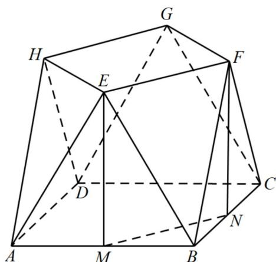
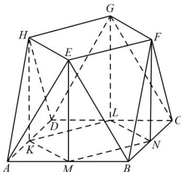
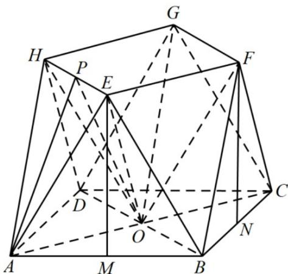

> [!faq]- 《专题21 立体几何大题综合》真题解析
>
> > [!success]- **【答案】** 详见解析
>
> > [!note]- **【分析】**
> > 【分析】（1）分别取 $AB, BC$ 的中点 $M, N$ ，连接 $MN$ ，由平面知识可知 $EM \perp AB, FN \perp BC$ ， $EM = FN$ ，依题从而可证 $EM \perp$ 平面 $ABCD$ ， $FN \perp$ 平面 $ABCD$ ，根据线面垂直的性质定理可知 $EM // FN$ ，即可知四边形 $EMNF$ 为平行四边形，于是 $EF // MN$ ，最后根据线面平行的判定定理即可证出；
> >
> > (2) 再分别取 $AD, DC$ 中点 $K, L$ ，由 (1) 知，该几何体的体积等于长方体 $KMNL - EFGH$ 的体积加上四棱锥 $B - MNFE$ 体积的 4 倍，即可解出。
>
> > [!note]- **【解析】**
> > 【详解】（1）如图所示：
> > 
> > 分别取 $AB, BC$ 的中点 $M, N$ ，连接 $MN$ ，因为 $\triangle EAB, \triangle FBC$ 为全等的正三角形，所以 $EM \perp AB, FN \perp BC$
> > $EM = FN$ ，又平面 $EAB \perp$ 平面 $ABCD$ ，平面 $EAB \cap$ 平面 $ABCD = AB$ ， $EM \subset$ 平面 $EAB$ ，所以 $EM \perp$ 平面 $ABCD$ ，同理可得 $FN \perp$ 平面 $ABCD$ ，根据线面垂直的性质定理可知 $EM // FN$ ，而 $EM = FN$ ，所以四边形 $EMNF$ 为平行四边形，所以 $EF // MN$ ，又 $EF \notin$ 平面 $ABCD$ ， $MN \subset$ 平面 $ABCD$ ，所以 $EF //$ 平面 $ABCD$ 。
> > (2) [方法一]：分割法一
> > 如图所示：
> > 
> > 分别取 AD, DC 中点 K, L，由（1）知，EF // MN 且 EF = MN，同理有，HE // KM, HE = KM，
> > HG // KL, HG = KL，GF // LN, GF = LN，由平面知识可知，BD ⊥ MN，MN ⊥ MK，
> > $KM = MN = NL = LK$ ，所以该几何体的体积等于长方体 KMNL - EFGH 的体积加上四棱锥 B - MNFE 体积的 4 倍．
> > 因为 $MN = NL = LK = KM = 4\sqrt{2}$ ， $EM = 8\sin 60^{\circ} = 4\sqrt{3}$ ，点 $B$ 到平面MNFE的距离即为点 $B$ 到直线MN的距离 $d$ ， $d = 2\sqrt{2}$ ，所以该几何体的体积
> > $$
> > V = (4 \sqrt {2}) ^ {2} \times 4 \sqrt {3} + 4 \times \frac {1}{3} \times 4 \sqrt {2} \times 4 \sqrt {3} \times 2 \sqrt {2} = 1 2 8 \sqrt {3} + \frac {2 5 6}{3} \sqrt {3} = \frac {6 4 0}{3} \sqrt {3}
> > $$
> > [方法二]：分割法二
> > 如图所示：
> > 
> > 连接 AC,BD,交于 O，连接 OE,OF,OG,OH. 则该几何体的体积等于四棱锥 O-EFGH 的体积加上三棱锥 A-OEH 的 4 倍·再加上三棱锥 E-OAB 的四倍．容易求得，OE=OF=OG=OH=8，取 EH 的中点 P，连接 AP,OP. 则 EH 垂直平面 APO. 由图可知，三角形 APO,四棱锥 O-EFGH 与三棱锥 E-OAB 的高均为 EM 的长·所以该几何体的体积 $V=\frac{1}{3}\cdot4\sqrt{3}\cdot\left(4\sqrt{2}\right)^{2}+4\cdot\frac{1}{3}\cdot4\sqrt{2}\cdot\frac{1}{2}4\sqrt{2}\cdot4\sqrt{3}+4\cdot\frac{1}{3}\cdot4\sqrt{3}\cdot\frac{1}{2}4\sqrt{2}\cdot4\sqrt{2}=\frac{640\sqrt{3}}{3}.$
