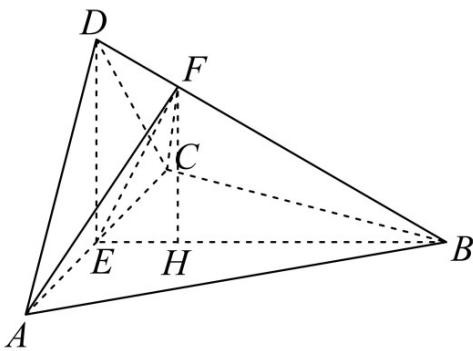

> [!faq]- 《专题21 立体几何大题综合》真题解析
>
> > [!success]- **【答案】** 详见解析
>
> > [!note]- **【分析】**
> > （1）通过证明 $AC \perp$ 平面 BED 来证得平面 $BED \perp$ 平面 ACD.
> >
> > (2) 首先判断出三角形 $AFC$ 的面积最小时 $F$ 点的位置，然后求得 $F$ 到平面 $ABC$ 的距离，从而求得三棱锥 $F - ABC$ 的体积.
>
> > [!note]- **【解析】**
> > （1）由于 AD = CD，E 是 AC 的中点，所以 $AC \perp DE$ .
> > 由于 $\left\{\begin{aligned}AD&=CD\\ BD&=BD\\ \angle ADB&=\angle CDB\end{aligned}\right.$ ，所以 $\triangle ADB\cong\triangle CDB$
> > 所以 AB = CB ，故 $AC \perp BE$
> > 由于 $DE \cap BE = E$ ， $DE, BE \subset$ 平面 BED，
> > 所以 $AC \perp$ 平面 BED ，
> > 由于 $AC \subset$ 平面 ACD ，所以平面 $BED \perp$ 平面 ACD .
> > ## (2) [方法一]: 判别几何关系
> > 依题意 $AB = BD = BC = 2$ ， $\angle ACB = 60^{\circ}$ ，三角形 $ABC$ 是等边三角形，
> > 所以 AC = 2, AE = CE = 1, BE = $\sqrt{3}$
> > 由于 $AD = CD, AD \perp CD$ ，所以三角形 $ACD$ 是等腰直角三角形，所以 $DE = 1$ .
> > $DE^{2} + BE^{2} = BD^{2}$ ，所以 $DE\perp BE$
> > 由于 $AC \cap BE = E$ ， $AC, BE \subset$ 平面 ABC，所以 $DE \perp$ 平面 ABC。
> > 由于 $\triangle ADB\cong \triangle CDB$ ，所以 $\angle FBA = \angle FBC$
> > 由于 $\left\{\begin{aligned}BF&=BF\\ \angle FBA&=\angle FBC\\ AB&=CB\end{aligned}\right.$ ，所以 $\triangle FBA\cong\triangle FBC$
> > 所以 AF = CF ，所以 $EF \perp AC$
> > 由于 $S_{\triangle AFC} = \frac{1}{2}\cdot AC\cdot EF$ ，所以当 $EF$ 最短时，三角形 $AFC$ 的面积最小
> > 过 E 作 $EF \perp BD$ ，垂足为 F，
> > 在 $\mathrm{Rt}^{\triangle}$ BED 中， $\frac{1}{2} \cdot BE \cdot DE = \frac{1}{2} \cdot BD \cdot EF$ ，解得 $EF = \frac{\sqrt{3}}{2}$ ，
> > 所以 $DF = \sqrt{1^2 - \left(\frac{\sqrt{3}}{2}\right)^2} = \frac{1}{2}, BF = 2 - DF = \frac{3}{2}$
> > 所以 $\frac{BF}{BD}=\frac{3}{4}$
> > 过 $F$ 作 $FH \perp BE$ ，垂足为 $H$ ，则 $FH // DE$ ，所以 $FH \perp$ 平面 $ABC$ ，且 $\frac{FH}{DE} = \frac{BF}{BD} = \frac{3}{4}$ ，
> > 所以 $FH = \frac{3}{4}$ ，
> > 所以 $V_{F-ABC}=\frac{1}{3}\cdot S_{\triangle ABC}\cdot FH=\frac{1}{3}\times\frac{1}{2}\times2\times\sqrt{3}\times\frac{3}{4}=\frac{\sqrt{3}}{4}$ .
> > 
> > [方法二]：等体积转换
> > $\because AB = BC, \angle ACB = 60^{\circ}, AB = 2$
> > $\therefore \Delta ABC$ 是边长为 $^{2}$ 的等边三角形，
> > $\therefore BE = \sqrt{3}$
> > 连接 EF
> > $$
> > \because \Delta A D B \cong \Delta C D B \therefore A F = C F
> > $$
> > $$
> > \therefore E F \perp A C
> > $$
> > ∴在 $\Delta BED$ 中，当 $EF\perp BD$ 时， $\Delta AFC$ 面积最小
> > ∵ $AD \perp CD, AD = CD, AC = 2, E$ 为 AC 中点
> > $$
> > \therefore D E = 1 \because D E ^ {2} + B E ^ {2} = B D ^ {2}
> > $$
> > $\therefore BE \perp ED$
> > 若 $EF \perp BD,$ 在 $\Delta BED$ 中， $EF = \frac{BE \cdot DE}{BD} = \frac{\sqrt{3}}{2}$
> > $$
> > B F = \sqrt {B E ^ {2} - E F ^ {2}} = \frac {3}{2}
> > $$
> > $$
> > \therefore S _ {\triangle B E F} = \frac {1}{2} B F \cdot E F = \frac {1}{2} \cdot \frac {3}{2} \cdot \frac {\sqrt {3}}{2} = \frac {3 \sqrt {3}}{8}
> > $$
> > $$
> > \therefore V _ {F - A B C} = V _ {A - B E F} + V _ {C - B E F} = \frac {1}{3} S _ {\Delta B E F} \cdot A C = \frac {1}{3} \cdot \frac {3 \sqrt {3}}{8} \cdot 2 = \frac {\sqrt {3}}{4}
> > $$
