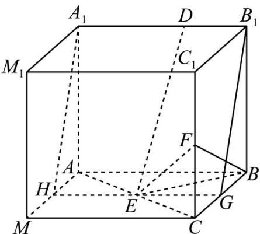

> [!faq]- 《专题21 立体几何大题综合》真题解析
>
> > [!success]- **【答案】** 详见解析
>
> > [!note]- **【分析】**
> > 【分析】（1）先证明 $\triangle ABC$ 为等腰直角三角形，然后利用体积公式可得三棱锥的体积；
> >
> > (2) 将所给的几何体进行补形，从而把线线垂直的问题转化为证明线面垂直，然后再由线面垂直可得题中的结论：
>
> > [!note]- **【解析】**
> > 【详解】（1）由于 $BF \perp A_{1}B_{1}$ ， $AB //A_{1}B_{1}$ ，所以 $AB \perp BF$ ，
> > 又 $AB \perp BB_{1}$ , $BB_{1} \cap BF = B$ , 故 $AB \perp$ 平面 $BCC_{1}B_{1}$
> > 则 $AB \perp BC$ ， $\triangle ABC$ 为等腰直角三角形，
> > $$
> > S _ {\triangle B C E} = \frac {1}{2} S _ {\triangle A B C} = \frac {1}{2} \times \left(\frac {1}{2} \times 2 \times 2\right) = 1, V _ {F - E B C} = \frac {1}{3} \times S _ {\triangle B C E} \times C F = \frac {1}{3} \times 1 \times 1 = \frac {1}{3}.
> > $$
> > (2) 由 (1) 的结论可将几何体补形为一个棱长为 $^{2}$ 的正方体 $ABCM-A_{1}B_{1}C_{1}M_{1}$ ，如图所示，取棱 $AM,BC$ 的中点 $H,G$ ，连结 $A_{1}H,HG,GB_{1}$ ，
> > 
> > 正方形 $BCC_{1}B_{1}$ 中， $G, F$ 为中点，则 $BF \perp B_{1}G$
> > 又 $BF \perp A_{1}B_{1}, A_{1}B_{1} \cap B_{1}G = B_{1}$
> > 故 $BF \perp$ 平面 $A_{1}B_{1}GH$ ，而 $DE \subset$ 平面 $A_{1}B_{1}GH$
> > 从而 $BF \perp DE \cdot$
> > 【点睛】求三棱锥的体积时要注意三棱锥的每个面都可以作为底面，例如三棱锥的三条侧棱两两垂直，我们就选择其中的一个侧面作为底面，另一条侧棱作为高来求体积．对于空间中垂直关系（线线、线面、面面）的证明经常进行等价转化·
