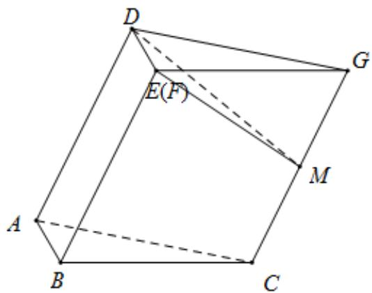

> [!faq]- 《专题21 立体几何大题综合》真题解析
>
> > [!success]- **【答案】** 详见解析
>
> > [!note]- **【分析】**
> > (1)因为折纸和粘合不改变矩形ABED，Rt△ABC和菱形BFGC内部的夹角，所以AD//BE
> >
> > $BF // CG$ 依然成立，又因 E 和 F 粘在一起，所以得证·因为 AB 是平面 BCGE 垂线，所以易证· $^{(2)}$ 欲求四边形 ACGD 的面积，需求出 CG 所对应的高，然后乘以 CG 即可．
>
> > [!note]- **【解析】**
> > (1)证：∵ AD // BE，BF // CG，又因为 E 和 F 粘在一起.
> > ∴ AD // CG, A, C, G, D 四点共面.
> > $$
> > \because A B \perp B E, A B \perp B C
> > $$
> > $\therefore AB \perp$ 平面 BCGE， $\because AB \subset$ 平面 ABC， $\therefore$ 平面 $ABC \perp$ 平面 BCGE，得证.
> > (2)取 $CG$ 的中点 $M$ ，连结 $EM,DM$ ·因为 $AB//DE$ ， $AB \perp$ 平面 $BCGE$ ，所以 $DE \perp$ 平面 $BCGE$ ，故 $DE \perp CG$ ，由已知，四边形 $BCGE$ 是菱形，且 $\angle EBC = 60^{\circ}$ 得 $EM \perp CG$ ，故 $CG \perp$ 平面 $DEM$ ：
> > 因此 $DM \perp CG$
> > 在 $Rt^{\triangle} DEM$ 中， $DE = 1$ ， $EM = \sqrt{3}$ ，故 $DM = 2$ 。
> > 所以四边形 ACGD 的面积为 4.
> > 
> > 【点睛】很新颖的立体几何考题．首先是多面体粘合问题，考查考生在粘合过程中哪些量是不变的．再者粘合后的多面体不是直棱柱，最后将求四边形 $ACGD$ 的面积考查考生的空间想象能力·
