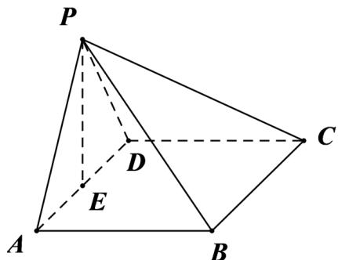

> [!faq]- 《专题21 立体几何大题综合》真题解析
>
> > [!success]- **【答案】** $(1)$ 证明见解析； $(2)$ $6+2\sqrt{3}$ 【详解】试题分析：（1）由 $\angle BAP = \angle CDP = 90^{\circ}$ ，得 $AB\perp AP$ ， $CD\perp PD$ 。从而得 $AB\perp PD$ ，进而而 $AB\perp$ 平面PAD，由面面垂直的判定定理可得平面 $PAB\perp$ 平面PAD；（2）设 $PA = PD = AB = DC = a$ ，取 $AD$ 中点 $O$ ，连结 $PO$ ，则 $PO\perp$ 底面ABCD，且 $AD = \sqrt{2} a,PO = \frac{\sqrt{2}}{2} a$ ，由四棱锥 $P - ABCD$ 的体积为 $\frac{8}{3}$ 求出 $a = 2$ ，由此能求出该四棱锥的侧面积· 试题
>
> > [!note]- **【分析】**
> > 本题未单列分析。
>
> > [!note]- **【解析】**
> > （1）由已知 $\angle BAP = \angle CDP = 90^{\circ}$ ，得 $AB\bot AP$ ， $CD\bot PD$
> > 由于 $AB \parallel CD$ ，故 $AB \perp PD$ ，从而 $AB \perp$ 平面 PAD。
> > 又 $AB \subset$ 平面 PAB ，所以平面 $PAB \perp$ 平面 PAD .
> > 
> > (2) 在平面 PAD 内作 $PE \perp AD$ ，垂足为 E。
> > 由（1）知， $AB \perp$ 面 $PAD$ ，故 $AB \perp PE$ ，可得 $PE \perp$ 平面 $ABCD$
> > 设 $AB = x$ ，则由已知可得 $AD = \sqrt{2} x$ ， $PE = \frac{\sqrt{2}}{2} x$
> > 故四棱锥 $P - ABCD$ 的体积 $V_{P - ABCD} = \frac{1}{3} AB\cdot AD\cdot PE = \frac{1}{3} x^3$
> > 由题设得 $\frac{1}{3}x^{3}=\frac{8}{3}$ ，故x=2。
> > 从而 $PA = PD = 2$ ， $AD = BC = 2\sqrt{2}$ ， $PB = PC = 2\sqrt{2}$
> > 可得四棱锥 P-ABCD 的侧面积为
> > $$
> > \frac {1}{2} P A \cdot P D + \frac {1}{2} P A \cdot A B + \frac {1}{2} P D \cdot D C + \frac {1}{2} B C ^ {2} \sin 6 0 ^ {\circ} = 6 + 2 \sqrt {3}
> > $$
