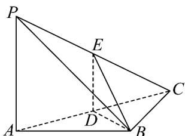

> [!faq]- 《专题21 立体几何大题综合》真题解析
>
> > [!success]- **【答案】** （1）证明见解析；（2）证明见解析；（3） $\frac{1}{3}$ 【详解】试题分析：（Ⅰ）要证明线线垂直，一般转化为证明线面垂直；（Ⅱ）要证明面面垂直，一般转化为证明线面垂直、线线垂直；（Ⅲ）由 $V=\frac{1}{3}\times S_{\triangle BCD}\times DE$ 即可求解· 试题
>
> > [!note]- **【分析】**
> > 本题未单列分析。
>
> > [!note]- **【解析】**
> > (1) 因为 $PA \perp AB$ ， $PA \perp BC$ ，所以 $PA \perp$ 平面 ABC
> > 又因为 $BD \subset$ 平面 $ABC$ ，所以 $PA \perp BD$ .
> > 
> > (Ⅱ) 因为 AB = BC，D 为 AC 中点，所以 $BD \perp AC$
> > 由（1）知， $PA \perp BD$ ，所以 $BD \perp$ 平面 PAC。
> > 所以平面 $BDE \perp$ 平面 $PAC$ .
> > (Ⅲ) 因为 $PA \parallel$ 平面 BDE，平面 $PAC \cap$ 平面 BDE = DE，
> > 所以 $PA \parallel DE$ .
> > 因为 D 为 AC 的中点，所以 $DE = \frac{1}{2} PA = 1$ ， $BD = DC = \sqrt{2}$ .
> > 由（1）知， $PA \perp$ 平面 ABC ，所以 $DE \perp$ 平面 PAC .
> > 所以三棱锥 E-BCD 的体积 $V=\frac{1}{6}BD\cdot DC\cdot DE=\frac{1}{3}$
> > 【名师点睛】线线、线面的位置关系以及证明是高考的重点内容，而其中证明线面垂直又是重点和热点，要证明线面垂直，根据判定定理可转化为证明线与平面内的两条相交直线垂直，也可根据性质定理转化为证明面面垂直·
