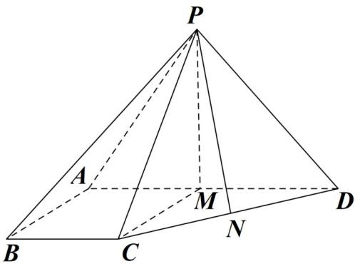

> [!faq]- 《专题21 立体几何大题综合》真题解析
>
> > [!success]- **【答案】** 详见解析
>
> > [!note]- **【分析】**
> > 试题分析：证明线面平有两种思路，一是寻求线线平行，二是寻求面面平行；取AD中点M，由于平面PAD为等边三角形，则 $PM \perp AD$ ，利用面面垂直的性质定理可推出 $PM \perp$ 底面ABCD，设BC=x，表示相关的长度，利用 $\Delta PCD$ 的面积为 $2\sqrt{7}$ ，求出四棱锥的体积·
> >
> > 试题解析：
> >
> > (1) 在平面 ABCD 内，因为 $\angle BAD = \angle ABC = 90^{0}$ ，所以 BC // AD.
> >
> > 又 $BC \not\subset$ 平面 $PAD, AD \subset$ 平面 $PAD$ , 故 $BC \parallel$ 平面 $PAD$ .
> >
> > 
> >
> > (2) 取 AD 的中点 M，连接 PM, CM.
> >
> > 由 $AB = BC = \frac{1}{2} AD$ 及 $BC \parallel AD, \angle ABC = 90^{0}$ ,
> >
> > 得四边形 $ABCM$ 为正方形，则 $CM \perp AD$ .
> >
> > 因为侧面 $PAD$ 为等边三角形且垂直于底面 $ABCD$ ，平面 $PAD \cap$ 平面 $ABCD = AD$
> >
> > 所以 $PM \perp AD, PM \perp$ 底面 ABCD.
> >
> > 因为 $CM \subset$ 底面 ABCD ，所以 $PM \perp CM$ ，
> >
> > 设 BC = x，则 $CM = x, CD = \sqrt{2}x, PM = \sqrt{3}x, PC = PD = 2x$ ，取 CD 的中点 N，连接 PN，则 $PN \perp CD$ ，所以 $PN = \frac{\sqrt{14}}{2}x$ ，
> >
> > 因为 $\Delta PCD$ 的面积为 $2\sqrt{7}$ ，所以 $\frac{1}{2}\sqrt{2}x \times \frac{\sqrt{14}}{2} = 2\sqrt{7}$ ，
> >
> > 解得 x = -2（舍去），x = 2.
> >
> > 于是 $AB = BC = 2, AD = 4, PM = 2\sqrt{3}$ .
> >
> > 所以四棱锥 P-ABCD 的体积 $V=\frac{1}{3}\times\frac{2(2+4)}{2}\times2\sqrt{3}=4\sqrt{3}$ .
>
> > [!note]- **【解析】**
> > 本题未单列解析。
