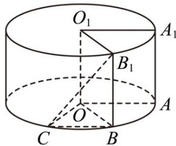

> [!faq]- 《专题21 立体几何大题综合》真题解析
>
> > [!success]- **【答案】** 详见解析
>
> > [!note]- **【分析】**
> > 本题未单列分析。
>
> > [!note]- **【解析】**
> > 【答案】(1) $\frac{\sqrt{3}}{12}(2)\frac{\pi}{4}$ .
> > 【详解】试题分析：（1）由题意可知，圆柱的高 $h = 1$ ，底面半径 $r = 1$ ， $\angle \mathrm{A}_{1}\mathrm{O}_{1}\mathrm{B}_{1} = \frac{\pi}{3}$ ，再由三角形面积公式计算 $S_{\triangle \mathrm{O}_1\mathrm{A}_1\mathrm{B}_1}$ 后即得·
> > (2) 设过点 $\mathbf{B}_1$ 的母线与下底面交于点 $\mathbf{B}$ ，根据 $\mathrm{BB}_1 / / \mathrm{AA}_1$ ，知 $\angle CB_1B$ 或其补角为直线 $B_1C$ 与 $\mathrm{AA}_1$ 所成的角，再结合题设条件确定 $\angle COB = \frac{\pi}{3}$ ， $CB = 1$ 。得出 $\angle CB_1B = \frac{\pi}{4}$ 即可。
> > 试题
> > 【答案】(1) $\frac{\sqrt{3}}{12}(2)\frac{\pi}{4}$ .
> > 【详解】试题分析：（1）由题意可知，圆柱的高 $h = 1$ ，底面半径 $r = 1$ ， $\angle \mathrm{A}_{1}\mathrm{O}_{1}\mathrm{B}_{1} = \frac{\pi}{3}$ ，再由三角形面积公式计算 $S_{\triangle \mathrm{O}_1\mathrm{A}_1\mathrm{B}_1}$ 后即得·
> > (2) 设过点 $\mathbf{B}_1$ 的母线与下底面交于点 $\mathbf{B}$ ，根据 $\mathrm{BB}_1 / / \mathrm{AA}_1$ ，知 $\angle CB_1B$ 或其补角为直线 $B_1C$ 与 $\mathrm{AA}_1$ 所成的角，再结合题设条件确定 $\angle COB = \frac{\pi}{3}$ ， $CB = 1$ 。得出 $\angle CB_1B = \frac{\pi}{4}$ 即可。
> > 试题解析：（1）由题意可知，圆柱的高 $h = 1$ ，底面半径 $r = 1$ ：
> > 由 $\square_{A_1B_1}$ 的长为 $\frac{\pi}{3}$ ，可知 $\angle A_1O_1B_1 = \frac{\pi}{3}$
> > $S_{\triangle O_1A_1B_1} = \frac{1}{2} O_1A_1\cdot O_1B_1\cdot \sin \angle A_1O_1B_1 = \frac{\sqrt{3}}{4}$
> > $$
> > \mathrm{V} _ {C - O _ {1} A _ {1} B _ {1}} = \frac {1}{3} S _ {\triangle O _ {1} A _ {1} B _ {1}} \cdot h = \frac {\sqrt {3}}{1 2}
> > $$
> > (2) 设过点 $\mathbf{B}_{1}$ 的母线与下底面交于点 $\mathbf{B}$ ，则 $\mathrm{BB}_{1} / / \mathrm{AA}_{1}$
> > 所以 $\angle CB_{1}B$ 或其补角为直线 $B_{1}C$ 与 $AA_{1}$ 所成的角．
> > 由 $\square_{AC}$ 长为 $\frac{2\pi}{3}$ ，可知 $\angle AOC = \frac{2\pi}{3}$
> > 又 $\angle AOB = \angle A_{1}O_{1}B_{1} = \frac{\pi}{3}$ ，所以 $\angle COB = \frac{\pi}{3}$ ，
> > 从而 $\triangle COB$ 为等边三角形，得 CB = 1
> > 因为 $\mathrm{B}_1\mathrm{B} \perp$ 平面 $AOC$ ，所以 $B_1B \perp CB$
> > 在 $\triangle CB_{1}B$ 中，因为 $\angle B_{1}BC = \frac{\pi}{2}$ ， $CB = 1$ ， $\mathrm{B}_1\mathrm{B} = 1$ ，所以 $\angle CB_1B = \frac{\pi}{4}$
> > 从而直线 $B_{1}C$ 与 $\mathrm{AA}_{1}$ 所成的角的大小为 $\frac{\pi}{4}$
> > 
> > 【考点】几何体的体积、空间角
> > 【名师点睛】此类题目是立体几何中的常见问题·解答本题时，关键在于能利用直线与直线、直线与平面、平面与平面位置关系的相互转化，将空间问题转化成平面问题·立体几何中的角与距离的计算问题，往往可以利用几何法、空间向量方法求解，应根据题目条件，灵活选择方法·本题能较好地考查考生的空间想象能力、逻辑推理能力、转化与化归思想及基本运算能力等·
