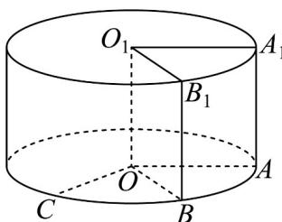

> [!faq]- 《专题21 立体几何大题综合》真题解析
>
> > [!success]- **【答案】** 详见解析
>
> > [!note]- **【分析】**
> > 本题未单列分析。
>
> > [!note]- **【解析】**
> > 【答案】（1） $\pi, 2\pi$ ；（2） $\frac{\pi}{2}$
> > 【详解】
> > 
> > (1) 由题意可知，圆柱的母线长 $l = 1$ ，底面半径 $r = 1$
> > 圆柱的体积 $V = \pi r^{2}l = \pi \times 1^{2}\times 1 = \pi$
> > 圆柱的侧面积 $S = 2\pi rl = 2\pi \times 1\times 1 = 2\pi$
> > (2) 设过点 $B_{1}$ 的母线与下底面交于点 B，则 $O_{1}B_{1}//OB$
> > 所以 $\angle COB$ 或其补角为 $O_{1}B_{1}$ 与 $OC$ 所成的角.
> > 由 $\square_{1}B_{1}$ 长为 $\frac{\pi}{3}$ ，可知 $\angle AOB = \angle A_{1}O_{1}B_{1} = \frac{\pi}{3}$ ，
> > 由 $\square_{AC}$ 长为 $\frac{5\pi}{6}$ ，可知 $\angle AOC = \frac{5\pi}{6}$ ， $\angle COB = \angle AOC - \angle AOB = \frac{\pi}{2}$ ，
> > 所以异面直线 $O_{1}B_{1}$ 与 $OC$ 所成的角的大小为 $\frac{\pi}{2}$
