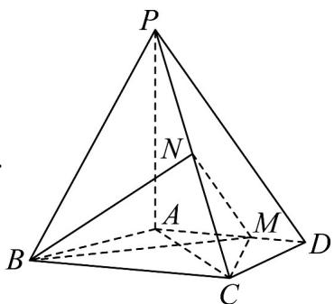
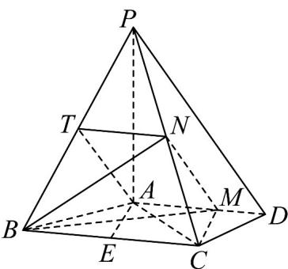

> [!faq]- 《专题21 立体几何大题综合》真题解析
>
> > [!success]- **【答案】** $$ N - B C M $$ 【答案】(Ⅰ)证明见解析；(Ⅱ) $\frac{4}{3}\sqrt{5}$ 【详解】试题分析：（Ⅰ）取 $PB$ 的中点 $T$ ，然后结合条件中的数据证明四边形 $AMNT$ 为平行四边形，从而得到 $MN \parallel AT$ ，由此结合线面平行的判断定理可证；（Ⅱ）由条件可知四面体 $^{N-BCM}$ 的高，即点 $N$ 到底面的距离为棱 $PA$ 的一半，由此可顺利求得结果。 试题
>
> > [!note]- **【分析】**
> > 本题未单列分析。
>
> > [!note]- **【解析】**
> > 
> > （1）由已知得 $AM = \frac{2}{3} AD = 2$ ，取 $BP$ 的中点 $T$ ，连接 $AT, TN$ ，由 $N$ 为 $PC$ 中点知 $TN // BC$ ， $TN = \frac{1}{2} BC = 2$ .
> > 又 $AD \parallel BC$ ，故 $TN$ 平行且等于 $AM$ ，四边形 $AMNT$ 为平行四边形，于是 $MN \parallel AT$ 。
> > 因为 $AT \subset$ 平面 PAB， $MN \not\subset$ 平面 PAB，所以 $MN \parallel$ 平面 PAB。
> > 
> > （Ⅱ）因为 $PA \perp$ 平面 ABCD，N 为 PC 的中点，
> > 所以 N 到平面 ABCD 的距离为 $\frac{1}{2}PA$ .
> > 取 $BC$ 的中点 $E$ ，连结 $AE$ 由 $AB = AC = 3$ 得 $AE \perp BC$ ， $AE = \sqrt{AB^2 - BE^2} = \sqrt{5}$
> > 由 $AM \parallel BC$ 得 $M$ 到 $BC$ 的距离为 $\sqrt{5}$ ，故 $S_{\triangle BCM} = \frac{1}{2} \times 4 \times \sqrt{5} = 2\sqrt{5}$ .
> > 所以四面体 N-BCM 的体积 $V_{N-BCM} = \frac{1}{3} \times S_{\triangle BCM} \times \frac{PA}{2} = \frac{4\sqrt{5}}{3}$ .
> > 【考点】直线与平面间的平行与垂直关系、三棱锥的体积
> > 【技巧点拨】（1）证明立体几何中的平行关系，常常是通过线线平行来实现，而线线平行常常利用三角形的中位线、平行四边形与梯形的平行关系来推证；（2）求三棱锥的体积关键是确定其高，而高的确定关键又找出顶点在底面上的射影位置，当然有时也采取割补法、体积转换法求解。
