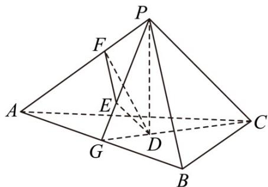

> [!faq]- 《专题21 立体几何大题综合》真题解析
>
> > [!success]- **【答案】** （Ⅰ）见解析；（Ⅱ）作图见解析，体积为 $\frac{4}{3}$ 【详解】试题分析：证明 $AB \perp PG$ . 由 $PA = PB$ 可得 $G$ 是 $AB$ 的中点·（Ⅱ）在平面 $PAB$ 内，过点 $E$ 作 $PB$ 的平行线交 $PA$ 于点 $F$ ， $F$ 即为 $E$ 在平面 $PAC$ 内的正投影·根据正三棱锥的侧面是直角三角形且 $PA = 6$ ，可得 $DE = 2, PE = 2\sqrt{2}$ . 在等腰直角三角形 $EFP$ 中，可得 $EF = PF = 2$ . 四面体 $PDEF$ 的体积 $$ V = \frac {1}{3} \times \frac {1}{2} \times 2 \times 2 \times 2 = \frac {4}{3}. $$ 试题
>
> > [!note]- **【分析】**
> > 本题未单列分析。
>
> > [!note]- **【解析】**
> > （Ⅰ）因为 P 在平面 ABC 内的正投影为 D，所以 $AB \perp PD$ .
> > 
> > 因为 D 在平面 PAB 内的正投影为 E，所以 $AB \perp DE$ .
> > 所以 $AB \perp$ 平面 PED，故 $AB \perp PG$ .
> > 又由已知可得，PA = PB，从而 G 是 AB 的中点。
> > (Ⅱ) 在平面 PAB 内，过点 E 作 PB 的平行线交 PA 于点 F，F 即为 E 在平面 PAC 内的正投影.
> > 理由如下：由已知可得 $PB \perp PA$ ， $PB \perp PC$ ，又 $EF // PB$ ，所以 $EF \perp PA$ ， $EF \perp PC$ ，因此 $EF \perp$ 平面 $PAC$
> > 即点 F 为 E 在平面 PAC 内的正投影.
> > 连结 $CG$ ，因为 $P$ 在平面 $ABC$ 内的正投影为 $D$ ，所以 $D$ 是正三角形 $ABC$ 的中心
> > 由（1）知，G 是 AB 的中点，所以 D 在 CG 上，故 $CD = \frac{2}{3}CG$ .
> > 由题设可得 $PC \perp$ 平面 $PAB$ ， $DE \perp$ 平面 $PAB$ ，所以 $D // PC$
> > 因此 $PE = \frac{2}{3}PG, DE = \frac{1}{3}PC.$
> > 由已知，正三棱锥的侧面是直角三角形且 $PA = 6$ ，可得 $DE = 2, PE = 2\sqrt{2}$
> > 在等腰直角三角形 EFP 中，可得 EF = PF = 2.
> > 所以四面体 $PDEF$ 的体积 $V = \frac{1}{3} \times \frac{1}{2} \times 2 \times 2 \times 2 = \frac{4}{3}$ .
> > 【考点】线面位置关系及几何体体积的计算
> > 【名师点睛】文科立体几何解答题主要考查线面位置关系的证明及几何体体积的计算,空间中线面位置关系的证明主要包括线线、线面、面面三者的平行与垂直关系,其中推理论证的关键是结合空间想象能力进行推理,注意防止步骤不完整或考虑不全致推理片面,该类题目难度不大,以中档题为主.
