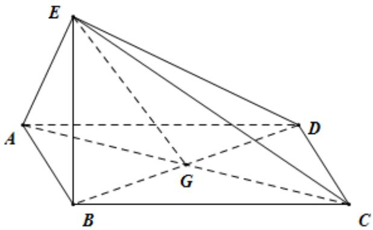

> [!faq]- 《专题21 立体几何大题综合》真题解析
>
> > [!success]- **【答案】** 详见解析
>
> > [!note]- **【分析】**
> > 【分析】（1）由四边形ABCD为菱形知 $AC \perp BD$ ，由 $BE \perp$ 平面ABCD知 $AC \perp BE$ ，由线面垂直判定定理知 $AC \perp$ 平面BED，由面面垂直的判定定理知平面 $AEC \perp$ 平面BED；
> >
> > (2) 设 AB = x ，通过解直角三角形将 AG、GC、GB、GD 用 x 表示出来，在 RtΔAEC 中，用 x 表示 EG，在 $Rt\Delta^{EBG}$ 中，用 x 表示 EB，根据条件三棱锥 $E-ACD$ 的体积为 $\frac{\sqrt{6}}{3}$ 求出 x，即可求出三棱锥 $E-ACD$ 的侧
> > 面积·
>
> > [!note]- **【解析】**
> > 【详解】（1）因为四边形ABCD为菱形，所以 $AC \perp BD$ ，
> > 因为 $BE \perp$ 平面 ABCD，所以 $AC \perp BE$ ，故 $AC \perp$ 平面 BED·
> > 又 $AC \subset$ 平面 $AEC$ , 所以平面 $AEC \perp$ 平面 $BED$
> > (2) 设 $AB = x$ ，在菱形 ABCD 中，由 $\angle ABC = 120^{\circ}$ ，可得 $AG = GC = \frac{\sqrt{3}}{2}x$ ， $GB = GD = \frac{x}{2}$ .
> > 因为 $AE \perp EC$ ，所以在 $Rt\Delta AEC$ 中，可得 $EG=\frac{\sqrt{3}}{2}x$ .
> > 连接 $EG$ ，由 $BE_{\perp}$ 平面ABCD，知 $\Delta^{EBG}$ 为直角三角形，可得 $BE = \frac{\sqrt{2}}{2} x.$
> > 
> > 由已知得，三棱锥 $E - ACD$ 的体积 $V_{E - ACD} = \frac{1}{3}\times \frac{1}{2} AC\cdot GD\cdot BE = \frac{\sqrt{6}}{24} x^3 = \frac{\sqrt{6}}{3}\cdot$ 故 $x = 2$
> > 从而可得 $AE=EC=ED=\sqrt{6}$ .
> > 所以 $\Delta EAC$ 的面积为 $3$ ， $\Delta EAD$ 的面积与 $\Delta ECD$ 的面积均为 $\sqrt{5}$
> > 故三棱锥 $E^{-}ACD$ 的侧面积为 $3+2\sqrt{5}$ .
> > 【点睛】本题考查线面垂直的判定与性质；面面垂直的判定；三棱锥的体积与表面积的计算；逻辑推理能力；运算求解能力·
