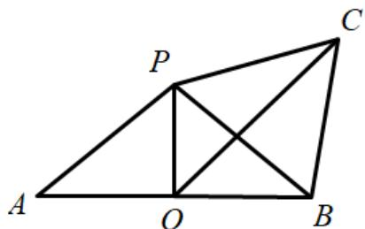

> [!faq]- 《专题21 立体几何大题综合》真题解析
>
> > [!success]- **【答案】** （Ⅰ）详见解析；（Ⅱ） $\frac{1}{3}$ ；（Ⅲ） $\frac{\sqrt{2}+\sqrt{6}}{2}$
>
> > [!note]- **【分析】**
> > 本题未单列分析。
>
> > [!note]- **【解析】**
> > （Ⅰ）在 $\Delta AOC$ 中，因为 OA = OC，D 为 AC 的中点，
> > 所以 $\mathrm{AC} \perp \mathrm{OD}$ 。又 $\mathrm{PO}$ 垂直于圆 $\mathrm{O}$ 所在的平面，所以 $\mathrm{PO} \perp \mathrm{AC}$ 。
> > 因为 DO ∩ PO = O ，所以 AC ⊥ 平面 PDO .
> > (Ⅱ) 因为点 C 在圆 O 上，
> > 所以当 $CO \perp AB$ 时，C 到 AB 的距离最大，且最大值为 1。
> > 又 AB = 2，所以 $\Delta ABC$ 面积的最大值为 $\frac{1}{2} \times 2 \times 1 = 1$
> > 又因为三棱锥 $\mathrm{P - ABC}$ 的高 $\mathrm{PO} = 1$ ，故三棱锥 $\mathrm{P - ABC}$ 体积的最大值为 $\frac{1}{3} \times 1 \times 1 = \frac{1}{3}$
> > （Ⅲ）在 $\Delta \mathrm{POB}$ 中， $\mathrm{PO} = \mathrm{OB} = 1$ ， $\angle \mathrm{POB} = 90^{\circ}$ ，所以 $\mathrm{PB} = \sqrt{1^2 + 1^2} = \sqrt{2}$
> > 同理 $\mathrm{PC} = \sqrt{2}$ ，所以 $\mathrm{PB} = \mathrm{PC} = \mathrm{BC}$
> > 在三棱锥P-ABC中，将侧面BCP绕PB旋转至平面 $\mathrm{BC}^{\prime}\mathrm{P}$ ，使之与平面ABP共面，如图所示.
> > 当O，E， $C^{\prime}$ 共线时， $\mathrm{CE} + \mathrm{OE}$ 取得最小值.
> > 又因为 OP = OB ， $C'P = C'B$ ，所以 $OC'$ 垂直平分 PB ，
> > 即 $\mathrm{E}$ 为 $\mathrm{PB}$ 中点．从而 $\mathrm{OC}^{\prime} = \mathrm{OE} + \mathrm{EC}^{\prime} = \frac{\sqrt{2}}{2} +\frac{\sqrt{6}}{2} = \frac{\sqrt{2} + \sqrt{6}}{2}$
> > 亦即 $CE + OE$ 的最小值为 $\frac{\sqrt{2} + \sqrt{6}}{2}$
> > 
> > 考点： $^{1}$ 、直线和平面垂直的判定； $^{2}$ 、三棱锥体积。
