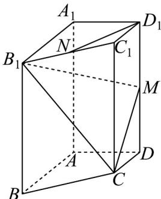

<!-- question-source:start -->
2.（2024·天津·高考真题）已知四棱柱 $ABCD - A_1B_1C_1D_1$ 中，底面 $ABCD$ 为梯形， $AB // CD$ ， $A_1A \perp$ 平面 $ABCD$ ， $AD \perp AB$ ，其中 $AB = AA_1 = 2, AD = DC = 1$ 。 $N$ 是 $B_1C_1$ 的中点， $M$ 是 $DD_1$ 的中点。

<!-- question-source:end -->

![[高中/真题/按题型分类/专题21 立体几何大题综合/考点03_求空间中的线段长度_点面距的值及最值或范围/对点训练/answers/Q00055449A1.md]]
