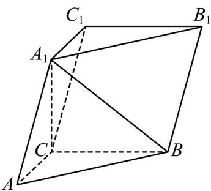

<!-- question-source:start -->
3. (2023·全国甲卷·高考真题) 如图, 在三棱柱 $ABC - A_{1}B_{1}C_{1}$ 中, $A_{1}C \perp$ 平面 $ABC, \angle ACB = 90^{\circ}$

<!-- question-source:end -->

![[高中/真题/按题型分类/专题21 立体几何大题综合/考点03_求空间中的线段长度_点面距的值及最值或范围/对点训练/answers/Q00055450A1.md]]
