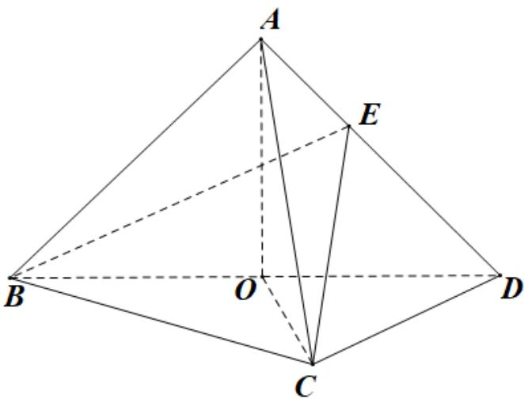

<!-- question-source:start -->
5.（2021·全国新I卷·高考真题）如图，在三棱锥 $A - BCD$ 中，平面 $ABD \perp$ 平面 $BCD$ ， $AB = AD$ ， $O$ 为 $BD$ 的中点·

<!-- question-source:end -->

![[高中/真题/按题型分类/专题21 立体几何大题综合/考点04_求空间中的体积_表面积的值及最值或范围/对点训练/answers/Q00055459A1.md]]
