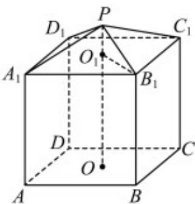

<!-- question-source:start -->
17.（2016·江苏·高考真题）现需要设计一个仓库，它由上下两部分组成，上部分的形状是正四棱锥 $P-A_{1}B_{1}C_{1}D_{1}$ ，下部分的形状是正四棱柱 $ABCD-A_{1}B_{1}C_{1}D_{1}$ （如图所示），并要求正四棱柱的高 $OO_{1}$ 是正四棱锥的高 $PO_{1}$ 的4倍.

<!-- question-source:end -->

![[高中/真题/按题型分类/专题21 立体几何大题综合/考点04_求空间中的体积_表面积的值及最值或范围/对点训练/answers/Q00055471A1.md]]
