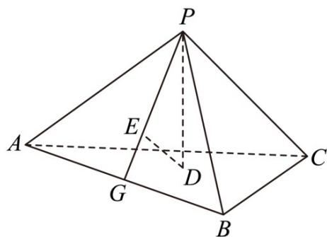

<!-- question-source:start -->
22.（2016·全国·高考真题）如图，已知正三棱锥 P-ABC 的侧面是直角三角形，PA=6，顶点 P 在平面 ABC 内的正投影为点 D，D 在平面 PAB 内的正投影为点 E，连结 PE 并延长交 AB 于点 G.

(Ⅰ) 证明： $^{G}$ 是 AB 的中点；

(II) 在图中作出点 $E$ 在平面 PAC 内的正投影 $F$ (说明作法及理由), 并求四面体 PDEF 的体积.
<!-- question-source:end -->

![[高中/真题/按题型分类/专题21 立体几何大题综合/考点04_求空间中的体积_表面积的值及最值或范围/对点训练/answers/Q00055476A1.md]]
