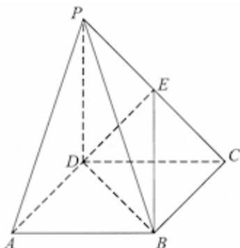

<!-- question-source:start -->
27．（2015·湖北·高考真题）《九章算术》中，将底面为长方形且有一条侧棱与底面垂直的四棱锥称之为阳马，将四个面都为直角三角形的四面体称之为鳖臑．在如图所示的阳马P-ABCD中，侧棱PD⊥底面ABCD，且PD=CD，点E是PC的中点，连接DE,BD,BE．

(Ⅰ) 证明： $DE \perp$ 平面 PBC．试判断四面体 EBCD 是否为鳖臑，若是，写出其每个面的直角（只需写出结论）；若不是，请说明理由；

（Ⅱ）记阳马 $P - ABCD$ 的体积为 $V_{1}$ ，四面体 $EBCD$ 的体积为 $V_{2}$ ，求 $\frac{V_1}{V_2}$ 的值.
<!-- question-source:end -->

![[高中/真题/按题型分类/专题21 立体几何大题综合/考点04_求空间中的体积_表面积的值及最值或范围/对点训练/answers/Q00055481A1.md]]
