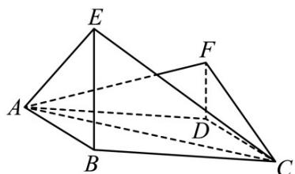

<!-- question-source:start -->
5.（2015·全国·高考真题）（2015新课标全国I理科）如图，四边形ABCD为菱形， $\angle ABC=120^{\circ}$ ，E，F是平面ABCD同一侧的两点， $BE^{\perp}$ 平面ABCD， $DF^{\perp}$ 平面ABCD， $BE^{\perp}2DF$ ， $AE^{\perp}EC$ .

<!-- question-source:end -->

![[高中/真题/按题型分类/专题21 立体几何大题综合/考点05_异面直线所成角及最值或范围/对点训练/answers/Q00055488A1.md]]
