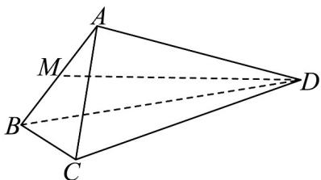

<!-- question-source:start -->
1．（2018·天津·高考真题）如图，在四面体ABCD中，△ABC是等边三角形，平面 $ABC^{\perp}$ 平面ABD，点M为棱AB的中点， $AB=2$ ， $AD=2\sqrt{3}$ ， $\angle BAD=90^{\circ}$ ．

(Ⅰ) 求证： $AD^{\perp}BC$ ;

(Ⅱ) 求异面直线 BC 与 MD 所成角的余弦值；

(Ⅲ) 求直线 CD 与平面 ABD 所成角的正弦值.

<!-- question-source:end -->

![[高中/真题/按题型分类/专题21 立体几何大题综合/考点05_异面直线所成角及最值或范围/真题/answers/Q00035887A1.md]]
