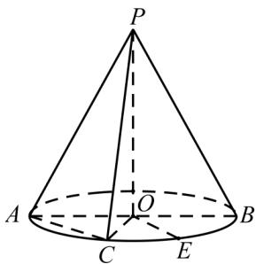

<!-- question-source:start -->
6.（2015·上海高考真题）如图，圆锥的顶点为 $P$ ，底面的一条直径为 $AB$ ， $C$ 为半圆弧 $AB$ 的中点， $E$ 为劣弧 $CB$ 的中点已知 $PO = 2$ ， $OA = 1$ ，求三棱锥 $P - AOC$ 的体积，并求异面直线 $PA$ 与 $OE$ 所成角的大小。

<!-- question-source:end -->

![[高中/真题/按题型分类/专题21 立体几何大题综合/考点05_异面直线所成角及最值或范围/真题/answers/Q00035892A1.md]]
