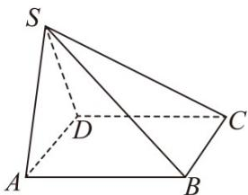

<!-- question-source:start -->
7．（2015·山东·高考真题）如下图，在四棱锥 S-ABCD 中，底面 ABCD 是正方形，平面 $SAD \perp$ 平面 ABCD，
SA = SD = 2, AB = 3.

<!-- question-source:end -->

![[高中/真题/按题型分类/专题21 立体几何大题综合/考点05_异面直线所成角及最值或范围/真题/answers/Q00035893A1.md]]
