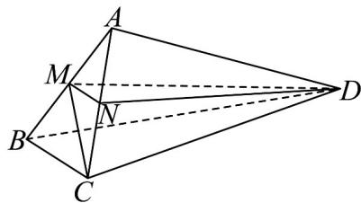

> [!faq]- 《专题21 立体几何大题综合》真题解析
>
> > [!success]- **【答案】** (Ⅰ)证明见解析；(Ⅱ) $\frac{\sqrt{13}}{26}$ ；(Ⅲ) $\frac{\sqrt{3}}{4}$
>
> > [!note]- **【分析】**
> > 本题未单列分析。
>
> > [!note]- **【解析】**
> > 分析：（Ⅰ）由面面垂直的性质定理可得 $AD^{\perp}$ 平面 ABC，则 $AD^{\perp}BC$
> > （Ⅱ）取棱 $AC$ 的中点 $N$ ，连接 $MN$ ， $ND$ ．由几何关系可知 $\angle DMN$ （或其补角）为异面直线 $BC$ 与 $MD$ 所成的角．计算可得 $cos\angle DMN = \frac{\frac{1}{2}MN}{DM} = \frac{\sqrt{13}}{26}$ ．则异面直线 $BC$ 与 $MD$ 所成角的余弦值为 $\frac{\sqrt{13}}{26}$ ：
> > （Ⅲ）连接 CM．由题意可知 $CM^{\perp}$ 平面 ABD．则 $\angle CDM$ 为直线 CD 与平面 ABD 所成的角．计算可得 $\sin\angle CDM=\frac{CM}{CD}=\frac{\sqrt{3}}{4}$ ．即直线 CD 与平面 ABD 所成角的正弦值为 $\frac{\sqrt{3}}{4}$ ．
> > 详解：（1）证明：由平面 $ABC^{\perp}$ 平面ABD，平面 $ABC^{\cap}$ 平面 $ABD=AB$ ， $AD^{\perp}AB$ ，可得 $AD^{\perp}$ 平面ABC，故 $AD^{\perp}BC$ 。
> > (Ⅱ) 取棱 AC 的中点 N，连接 MN，ND．又因为 M 为棱 AB 的中点，故 $MN^{\parallel}BC$ ．所以 $\angle DMN$ （或其补角）为异面直线 BC 与 MD 所成的角．
> > 
> > 在 Rt△DAM 中， $AM=1$ ，故 $DM=\sqrt{AD^{2}+AM^{2}}=\sqrt{13}$ 。因为 $AD\perp$ 平面 ABC，故 $AD\perp AC$
> > 在 Rt△DAN 中， $AN=1$ ，故 $DN=\sqrt{AD^{2}+AN^{2}}=\sqrt{13}$
> > 在等腰三角形 DMN 中，MN=1，可得 $\cos\angle DMN=\frac{\frac{1}{2}MN}{DM}=\frac{\sqrt{13}}{26}$
> > 所以，异面直线 $BC$ 与 $MD$ 所成角的余弦值为 $\frac{\sqrt{13}}{26}$
> > （Ⅲ）连接 CM．因为 $\triangle ABC$ 为等边三角形，M 为边 AB 的中点，故 $CM \perp AB, CM = \sqrt{3}$ ．又因为平面 $ABC \perp$ 平面 ABD，而 $CM \subset$ 平面 ABC，故 $CM \perp$ 平面 ABD．所以， $\angle CDM$ 为直线 CD 与平面 ABD 所成的角．
> > 在 Rt△CAD 中， $CD=\sqrt{AC^{2}+AD^{2}}=4$
> > 在 Rt△CMD 中， $\sin\angle CDM=\frac{CM}{CD}=\frac{\sqrt{3}}{4}$
> > 所以，直线 $CD$ 与平面 $ABD$ 所成角的正弦值为 $\frac{\sqrt{3}}{4}$
> > 点睛：本小题主要考查异面直线所成的角、直线与平面所成的角、平面与平面垂直等基础知识．考查空间
> > 想象能力、运算求解能力和推理论证能力．
