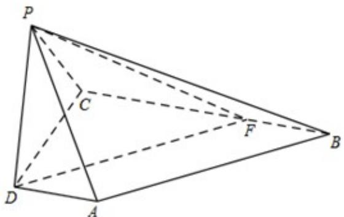

> [!faq]- 《专题21 立体几何大题综合》真题解析
>
> > [!success]- **【答案】** 详见解析
>
> > [!note]- **【分析】**
> > 【分析】（Ⅰ）由已知 $AD//BC$ ，故 $\angle DAP$ 或其补角即为异面直线 $AP$ 与 $BC$ 所成的角，然后在 Rt $\triangle PDA$ 中求解即可；（Ⅱ）因为 $AD \perp$ 平面 $PDC$ ，所以 $AD \perp PD$ ， $PD \perp BC$ ，又 $PD \perp PB$ ，所以 $PD \perp$ 平面 $PBC$ ；（Ⅲ）过点 $D$ 作 $AB$ 的平行线交 $BC$ 于点 $F$ ，连结 $PF$ ，则 $DF$ 与平面 $PBC$ 所成的角等于 $AB$ 与平面 $PBC$ 所成的角，且 $\angle DFP$ 为直线 $DF$ 和平面 $PBC$ 所成的角，然后在 Rt $\triangle DPF$ 中求解即可。
>
> > [!note]- **【解析】**
> > 【详解】解：（Ⅰ）如图，由已知 $AD//BC$ ，故 $\angle DAP$ 或其补角即为异面直线 $AP$ 与 $BC$ 所成的角·
> > 因为 $AD \perp$ 平面 PDC，所以 $AD \perp PD$ .
> > 在 Rt△PDA 中，由已知，得 $AP = \sqrt{AD^{2} + PD^{2}} = \sqrt{5}$
> > 故 $\cos\angle DAP=\frac{AD}{AP}=\frac{\sqrt{5}}{5}$
> > 所以，异面直线 $AP$ 与 $BC$ 所成角的余弦值为 $\frac{\sqrt{5}}{5}$
> > 
> > (II) 证明：因为 $AD \perp$ 平面 $PDC$ ，直线 $PD \subset$ 平面 $PDC$ ，所以 $AD \perp PD$ .
> > 又因为 BC//AD，所以 $PD \perp BC$ ，
> > 所以 $PD \perp$ 平面 PBC.
> > (Ⅲ) 过点 $D$ 作 $AB$ 的平行线交 $BC$ 于点 $F$ , 连结 $PF$ ,
> > 则 $DF$ 与平面 $PBC$ 所成的角等于 $AB$ 与平面 $PBC$ 所成的角.
> > 因为 $PD \perp$ 平面 PBC，故 PF 为 DF 在平面 PBC 上的射影，
> > 所以 $\angle DFP$ 为直线 $DF$ 和平面 $PBC$ 所成的角.
> > 由于 AD//BC，DF//AB，故 BF=AD=1，
> > 由已知，得 $CF = BC - BF = 2$
> > 又 $AD \perp DC$ ，故 $BC \perp DC$ ，
> > 在 Rt△DCF 中，可得 $DF = \sqrt{CD^{2} + CF^{2}} = 2\sqrt{5}$ ，
> > 在 Rt△DPF 中，可得 $\sin\angle DFP = \frac{PD}{DF} = \frac{\sqrt{5}}{5}$ .
> > 所以，直线 $AB$ 与平面 $PBC$ 所成角的正弦值为 $\frac{\sqrt{5}}{5}$
> > 考点：两条异面直线所成的角、直线与平面垂直、直线与平面所成的角
> > 【点睛】本小题主要考查两条异面直线所成的角、直线与平面垂直的证明、直线与平面所成的角，要求一
> > 定的空间想象能力、运算求解能力和推理论证能力·求两条异面直线所成的角，首先要借助平行线找出异面
> > 直线所成的角，证明线面垂直只需寻求线线垂直，求线面角首先利用转化思想寻求直线与平面所成的角，
> > 然后再计算即可·
