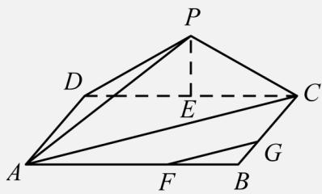

> [!faq]- 《专题21 立体几何大题综合》真题解析
>
> > [!success]- **【答案】** 详见解析
>
> > [!note]- **【分析】**
> > 【分析】（1）通过△PDC为等腰三角形可得 $PE_{\perp}CD$ ，利用线面垂直判定定理及性质定理即得结论；（2）通过（1）及面面垂直定理可得 $PG_{\perp}AD$ ，则∠PDC为二面角PAD.C的平面角，利用勾股定理即得结论；（3）连结AC，利用勾股定理及已知条件可得 $FG\|AC$ ，在△PAC中，利用余弦定理即得直线PA与直线FG所成角的余弦值．
>
> > [!note]- **【解析】**
> > 【详解】（1）证明：在△PDC中PO=PC且E为CD中点，
> > ∴PE⊥CD，
> > 又∵平面PDC⊥平面ABCD，平面PDC∩平面ABCD=CD，PE⊂平面PCD，
> > ∴PE⊥平面ABCD，
> > 又∵FG⊂平面ABCD，
> > ∴PE⊥FG；
> > （2）解：由（1）知PE⊥平面ABCD，∴PE⊥AD，
> > 又∵CD⊥AD且PE∩CD=E，
> > ∴AD⊥平面PDC，
> > 又∵PD⊂平面PDC，∴AD⊥PD，
> > 又∵AD⊥CD，∴∠PDC为二面角PAD.C的平面角，
> > 在Rt△PDE中，由勾股定理可得： $PE=\sqrt{PD^{2}-DE^{2}}=\sqrt{4^{2}-3^{2}}=\sqrt{7}$ ∴tan∠PDC= $\frac{PG}{DG}=\frac{\sqrt{7}}{3}$ ；
> > （3）解：连结AC，则 $AC=\sqrt{6^{2}+3^{2}}=3\sqrt{5}$ ，
> > 在Rt△ADP中， $AP=\sqrt{AD^{2}+DP^{2}}=\sqrt{3^{2}+4^{2}}=5$ ，
> > ∵AF=2FB，CG=2GB，
> > ∴FG∥AC，
> > ∴直线 PA 与直线 FG 所成角即为直线 PA 与直线 AC 所成角 ∠PAC，
> > 在 $\triangle PAC$ 中，由余弦定理得
> > $$
> > \begin{array}{l} \cos_ {2} P A C = \frac {P A ^ {2} + A C ^ {2} - P C ^ {2}}{2 P A \cdot A C} \\ = \frac {5 ^ {2} + (3 \sqrt {5}) ^ {2} - 4 ^ {2}}{2 \times 5 \times 3 \sqrt {5}} \\ = \frac {9}{2 5} \sqrt {5}. \end{array}
> > $$
> > 
> > 【点睛】
> > 本题考查线线垂直的判定、二面角及线线角的三角函数值，涉及到勾股定理、余弦定理等知识，注意解题方法的积累，属于中档题。
