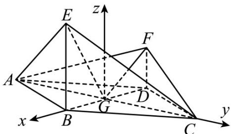

> [!faq]- 《专题21 立体几何大题综合》真题解析
>
> > [!success]- **【答案】** (1) 证明：平面 $AEC \perp$ 平面 AFC； (2) 求直线 AE 与直线 CF 所成角的余弦值. 【答案】 $(1)$ 见解析； $(2)\frac{\sqrt{3}}{3}$
>
> > [!note]- **【分析】**
> > 本题未单列分析。
>
> > [!note]- **【解析】**
> > 试题分析：（Ⅰ）连接 BD，设 $BD \cap AC = G$ ，连接 EG，FG，EF，在菱形 ABCD 中，不妨设 GB = 1 易证 $EG \perp AC$ ，通过计算可证 $EG \perp FG$ ，根据线面垂直判定定理可知 $EG \perp$ 平面 AFC，由面面垂直判定定理知平面 $AFC \perp$ 平面 AEC；（Ⅱ）以 G 为坐标原点，分别以 GB, GC 的方向为 x 轴，y 轴正方向， $|GB|$ 为单位长度，建立空间直角坐标系 G-xyz，利用向量法可求出异面直线 AE 与 CF 所成角的余弦值·
> > 试题解析：（I）连接 BD，设 $BD \cap AC = G$ ，连接 EG，FG，EF，在菱形 ABCD 中，不妨设 GB = 1，由 $\angle ABC = 120^{\circ}$ ，可得 $AG = GC = \sqrt{3}$ .
> > 由 BE⊥平面 ABCD，AB=BC 可知，AE=EC，
> > 又：AE⊥EC，∴EG= $\sqrt{3}$ ，EG⊥AC
> > 在 Rt△EBG 中，可得 BE= $\sqrt{2}$ ，故 DF= $\frac{\sqrt{2}}{2}$ .
> > 在 Rt△FDG 中，可得 $FG=\frac{\sqrt{6}}{2}$ .
> > 在直角梯形 BDFE 中，由 BD=2，BE= $\sqrt{2}$ ，DF= $\frac{\sqrt{2}}{2}$ 可得 EF= $\frac{3\sqrt{2}}{2}$
> > $\therefore EG^{2} + FG^{2} = EF^{2}\quad ,\therefore EG \perp FG$
> > ∵AC∩FG=G，∴EG⊥平面AFC，
> > ∵EG⊂面 AEC，∴平面 AFC⊥平面 AEC.
> > 
> > （Ⅱ）如图，以 $^{G}$ 为坐标原点，分别以 $\overline{GB},\overline{GC}$ 的方向为x轴， $^{Y}$ 轴正方向， $\left| \overline{GB} \right|$ 为单位长度，建立空间直角坐标系 $^{G-xyz}$ ，由（Ⅰ）可得 $^{A}\left(0,-\sqrt{3},0\right),E\left(1,0,\sqrt{2}\right),F\left(-1,0,\frac{\sqrt{2}}{2}\right),C\left(0,\sqrt{3},0\right),∴$
> > $\frac{uuu}{AE}=(1,\sqrt{3},\sqrt{2})$ , $\frac{uuu}{CF}=(-1,-\sqrt{3},\frac{\sqrt{2}}{2})$ $\cdots10$ 分
> > 故 $\cos\left\langle\overrightarrow{AE},\overrightarrow{CF}\right\rangle=\frac{\overrightarrow{AE}\cdot\overrightarrow{CF}}{\left|AE\right|\left|CF\right|}=-\frac{\sqrt{3}}{3}.$
> > 所以直线 AE 与 CF 所成的角的余弦值为 $\frac{\sqrt{3}}{3}$ .
> > 考点：空间垂直判定与性质；异面直线所成角的计算；空间想象能力，推理论证能力
