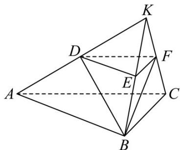

> [!faq]- 《zhenti-专题21 立体几何大题综合》例题解析
>
> > [!success]- **【答案】** （1）证明详见解析； （2） $\frac{\sqrt{21}}{7}$
>
> > [!note]- **【解析】**
> > 试题分析：本题主要考查空间点、线、面位置关系，线面角等基础知识，同时考查空间想象能力和运算求解能力。
> >
> > 试题解析：(Ⅰ)延长 $AD, BE, CF$ 相交于一点 $K$ ，如图所示
> >
> > 因为平面 $BCFE \perp$ 平面 $ABC$ ，且 $AC \perp BC$ ，所以
> >
> > $AC \perp$ 平面 $BCK$ ，因此， $BF \perp AC$ .
> >
> > 又因为 $EF / / BC$ ， $BE = EF = FC = 1$ ， $BC = 2$ ，所以
> >
> > $\triangle BCK$ 为等边三角形，且 $F$ 为 $CK$ 的中点，则 $BF \perp CK$
> >
> > 所以 $BF \perp$ 平面 $ACFD$ .
> >
> > (Ⅱ) 因为 $BF \perp$ 平面 ACK，所以 $\angle BDF$ 是直线 BD 与平面 ACFD 所成的角.
> >
> > 在 Rt△BFD 中， $BF = \sqrt{3}, DF = \frac{3}{2}$ ，得 $\cos\angle BDF = \frac{\sqrt{21}}{7}$ .
> >
> > 所以，直线 $BD$ 与平面 $ACFD$ 所成的角的余弦值为 $\frac{\sqrt{21}}{7}$
> >
> > 
>
> > [!note]- **【考点】**
> > 空间点、线、面位置关系、线面角·
> >
> > 【方法点睛】解题时一定要注意直线与平面所成的角的范围，否则很容易出现错误．证明线面垂直的关键是证明线线垂直，证明线线垂直常用的方法是直角三角形、等腰三角形的“三线合一”和菱形、正方形的对角线．
